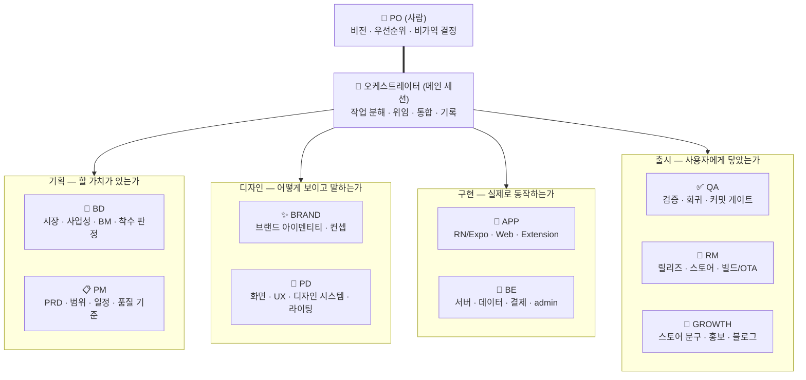
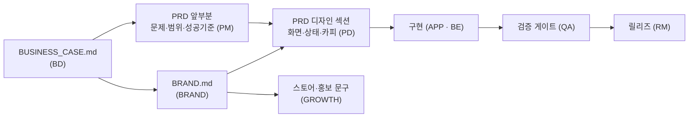

# AI Team Starter Kit

신규 애플리케이션을 PRD부터 출시·운영까지 한 팀으로 만들며 쌓인 경험을,
**다음 서비스를 만들 때 그대로 꺼내 쓰는 팀 구성**으로 증류한 킷입니다.

한 사람(PO) + Claude 멀티에이전트가 하나의 프로덕션 팀으로 움직이기 위한
조직도 · 일하는 방식 · 규칙 · 역할별 하네스가 들어 있습니다.

---

## 이 팀의 철학

> **"만드는 사람도 쓰는 사람도 행복한 서비스를 만들고 싶은 꼼지락쟁이.
> 임팩트 있게 작게 만들어 점차적으로 키워나가는 것을 선호한다."** — PO

이 한 문장이 아래 모든 규칙보다 위에 있습니다. 규칙은 이 문장을 실행 가능한
형태로 번역한 것일 뿐입니다.

| PO의 말 | 팀의 규약으로 |
|---|---|
| 🧡 **쓰는 사람이 행복하다** | 잘 될 때만이 아니라 **안 될 때까지** 명세한다 — 빈 화면·오류·기다림·권한 거부 |
| 🛠️ **만드는 사람도 행복하다** | 게이트와 하네스는 통제가 아니라 **같은 데서 두 번 헤매지 않게 하는 장치**다 |
| 🌱 **작게, 임팩트 있게** | 범위는 기능 목록이 아니라 **감당할 크기**로 정한다. 크기를 못 줄이면 문제를 다시 자른다 |
| 🔁 **점차 키운다 · 꼼지락** | 큰 결단 한 번보다 작은 손질 여러 번. 대신 **기록된 손질만 살아남는다** |

---

## 조직도



- **PO는 사람이고 한 명입니다.** 팀의 유일한 결정권자이며 에이전트가 대체하지 않습니다.
- **오케스트레이터는 메인 Claude 세션 자신입니다.** 별도 에이전트 파일이 없고,
  `AGENTS.md` + `TEAM.md`가 곧 그 하네스입니다.
- 역할 에이전트 9종은 오케스트레이터가 띄우는 서브에이전트입니다. 작은 일이면
  오케스트레이터가 **그 역할의 하네스를 읽고 직접** 처리해도 됩니다 —
  중요한 것은 프로세스(하네스 준수)지 프로세스 격리가 아닙니다.

### 산출물이 흐르는 방향



브랜드 톤은 `BRAND.md` **하나**에서 나오고 화면 문구·스토어 문구는 그것의 파생입니다.
PRD도 한 파일이며 PM이 앞부분, PD가 디자인 섹션을 **순차로** 씁니다 —
기능의 기준이 두 문서로 갈라지면 반드시 서로 어긋납니다.

---

## 역할 한눈에 보기

각 역할 하네스(`.claude/agents/*.md`)는 맨 앞에 **Role Definition** 8줄을 갖고
있습니다. 아래 표는 그 요약입니다. **주 산출물 = 그 파일의 주인이 한 명**이라는
선언입니다 (Apple의 DRI, Amazon의 single-threaded owner에서 가져온 원칙).

| 역할 | 한 줄 정의 | 주 산출물 (DRI) | 언제 부르나 |
|---|---|---|---|
| 💼 **BD** | 시간과 돈을 걸 가치가 있는지 판정한다 | `BUSINESS_CASE.md` | 새 아이템의 착수 판정, 수익 구조 |
| 📋 **PM** | 만들 것을 한 문서로 확정하고 범위가 새지 않게 지킨다 | `PRD.md`(앞부분) · `ROADMAP.md` | 무엇을 언제까지 어느 품질로 |
| ✨ **BRAND** | 제품의 정체성을 정하고 파생될 원본을 만든다 | `BRAND.md` · 아이덴티티 자산 | 제품의 얼굴과 성격을 정할 때 |
| 🎨 **PD** | 어떻게 보이고 어떻게 말하는지를 화면 단위로 확정한다 | `PRD.md` 디자인 섹션 · 디자인 시스템 | 화면 흐름·상태·문구·용어집 |
| 📱 **APP** | 설계된 화면을 실기기에서 동작하는 앱으로 만든다 | 클라이언트 코드 · 배포 경로 판정 | 앱·웹·익스텐션 구현 |
| 🔧 **BE** | 데이터와 돈의 길을 만들고 조용히 틀어지지 않게 한다 | 서버·스키마·결제 파이프 | 서버·데이터·결제·admin |
| ✅ **QA** | 완료 주장을 사실로 바꾼다 | 검증 게이트 · 회귀 시나리오 | 커밋 전, 릴리즈 전, 버그 조사 |
| 🚀 **RM** | 어떤 경로로 누구에게 먼저 내보낼지 판단한다 | 배포 경로 판정 · 제출 패키지 | 배포·심사·OTA |
| 📣 **GROWTH** | 제품을 아직 모르는 사람의 말로 옮긴다 | 스토어 등록 정보 · 홍보 초안 | 대외 문구·홍보물 |

> ⚠️ **역할이 9개라고 매번 9번 위임하지 않습니다.** 사업성이 이미 판정된 제품의
> 작은 기능이면 BD를 부르지 않고, 브랜드가 있으면 BRAND를 부르지 않습니다.
> **역할 수는 선택지지 절차가 아닙니다.**

### 경계가 헷갈리는 세 쌍

| 헷갈리는 쌍 | 가르는 기준 |
|---|---|
| BD ↔ PM | BD는 **돈이 어디서 오는가**, PM은 **무엇을 언제까지** |
| BRAND ↔ PD | BRAND는 **원본**(톤·컬러·심볼), PD는 **파생**(토큰·화면·문구) |
| PM ↔ 오케스트레이터 | PM은 **제품의 시간축**(마일스톤), ORCH는 **세션의 시간축**(이번 턴). **위임은 ORCH만** |

이 세 경계는 PO 승인으로 확정된 조직 규칙입니다 (`docs/DECISIONS.md` #1·#2).
바꿀 때는 기존 항목을 고쳐 덮지 않고 **새 결정 번호로 대체**합니다 — 왜 바뀌었는지가
남아야 다음 세션이 같은 논쟁을 반복하지 않습니다.

---

## 일하는 방식

### 새 제품 (0 → 1)

```
PO 아이디어
 → 💼 BD   BUSINESS_CASE (시장·경쟁·권리·수익·중단 기준) → 착수 판정안 ─── PO 판정
 → 📋 PM   PRD 앞부분 (크기·문제·범위·뺄 것·성공 기준) ────────────── PO 승인
 → ✨ BRAND BRAND.md (이름 후보·톤·컬러·심볼)      ※ PD보다 먼저. 파생은 원본 뒤에
 → 🎨 PD   PRD 디자인 섹션 (여정 프레임 → 화면·상태·카피) + 디자인 시스템
 → 🎯 ORCH 작업 분해 → 📱 APP + 🔧 BE → ✅ QA 게이트 → 🚀 RM 배포 판정 ── PO 승인
```

### 기존 제품의 기능 추가 (1 → n)

```
PO 지시 → 📋 PM (범위·성공 기준) → 🎨 PD (화면·카피) ── PO 승인
 → 🎯 ORCH 작업 분해 → 📱 APP + 🔧 BE (인터페이스 계약을 먼저 문서로 합의)
 → ✅ QA 검증 게이트 (통과 전 커밋 금지) → 🚀 RM 배포 경로 판정
 → 🎯 ORCH HARNESS "지금 상태" 갱신 + 커밋
```

> 💡 **BD·BRAND를 건너뜁니다.** 사업성이 판정된 제품의 작은 기능에 9번 위임하면
> 9배 느려집니다. 세션 하나로 끝날 크기면 오케스트레이터가 해당 하네스를 읽고
> 직접 처리하는 편이 낫습니다.

---

## 이 팀의 주요 특성 7가지

협업으로 이름난 팀들에서 **여러 곳에 공통으로 나타나고**, 우리 채록(실제 사고
기록)이 이미 같은 결론을 비싸게 배운 것만 가져왔습니다. 자세한 대응표와 출처는
[`TEAM.md` §7](TEAM.md)에 있습니다.

| # | 특성 | 이 팀에서의 모습 | 뿌리 |
|---|---|---|---|
| 1 | **결정마다 주인은 한 명** | 하네스마다 "주 산출물(DRI)" 한 줄. 기록자도 오케스트레이터 하나 | Apple DRI · Amazon single-threaded owner |
| 2 | **결정은 회의가 아니라 문서로** | `BUSINESS_CASE` · `PRD` · `BRAND` · `DECISIONS` — 대화로 넘긴 것은 다음 세션에서 증발한다 | Amazon PR-FAQ · Stripe |
| 3 | **고객에서 거꾸로 쓴다** | BD는 **보도자료 한 문단**부터, PD는 **여정 프레임**부터 | Amazon Working Backwards · Airbnb 스토리보드 |
| 4 | **시간을 고정하고 범위를 자른다** | PM이 PRD 맨 앞에 크기를 적는다. 넘치면 연장이 아니라 **다시 자르기** | Basecamp Shape Up · Linear |
| 5 | **비평은 있고 지시는 없다** | 에스컬레이션은 늘 **2~3안 + 트레이드오프**. 리뷰어가 소유자의 결정을 대신하지 않는다 | Pixar Braintrust · Figma crit |
| 6 | **사고는 사람이 아니라 시스템에 묻는다** | 모든 규칙표에 **"어기면"** 열이 있다 — 사고를 규칙 한 줄로 강등시킨 흔적 | Google SRE 사후분석 |
| 7 | **단계적으로 노출한다** | 테스터 트랙 → 실기기 확인 → 실사용자. 되돌릴 경로를 **발행 전에** 적는다 | Google SRE 카나리 |

> 🚫 **구조는 베끼지 않았습니다.** 가장 널리 복제된 Spotify의 스쿼드·트라이브는
> 정작 Spotify도 그대로 쓰지 않습니다 — 어휘만 베끼고 문화를 안 베끼면 남는 건
> 새 이름뿐입니다. 6주 사이클·베팅 테이블 같은 **회의체**, 분기 OKR, SLO 수치
> 운영도 1인 PO 팀에는 과해서 **개념만** 가져왔습니다.

---

## 구성

```
ai-team-kit/
├── README.md                  ← 이 문서 (팀 소개 · 킷 사용법)
├── TEAM.md                    ← 조직도 · 일하는 방식 · 팀 규칙 10조 (헌법)
├── AGENTS.md                  ← 세션 부트스트랩 (Claude가 자동으로 읽는 지시)
├── CLAUDE.md                  ← AGENTS.md 참조 링크
├── docs/
│   ├── HARNESS.md             ← 프로젝트 상태 하네스 (세션 간 인수인계의 축)
│   ├── DECISIONS.md           ← PO 결정 로그
│   └── PLAYBOOKS/
│       ├── APP_STORE_REVIEW.md    ← 심사 대응 (채록: 4제출 3반려 8일의 교훈)
│       ├── OTA_AND_BUILDS.md      ← OTA·빌드 예산 운용
│       ├── PAYMENTS_IAP.md        ← 인앱결제·구독 정체성 모델
│       └── DEBUGGING_PRINCIPLES.md← 사고에서 뽑은 디버깅 원칙
└── .claude/
    ├── agents/                ← 역할별 하네스 (각각 Role Definition 8줄로 시작)
    │   ├── bd.md              ← 💼 시장·사업성·BM·착수 판정
    │   ├── pm.md              ← 📋 PRD·범위·일정·품질 기준
    │   ├── brand.md           ← ✨ 브랜드 아이덴티티·컨셉 디자인
    │   ├── pd.md              ← 🎨 화면·UX·디자인 시스템·라이팅
    │   ├── app-dev.md         ← 📱 RN/Expo — iOS/AOS/Web/Extension
    │   ├── be-dev.md          ← 🔧 서버·데이터·결제·admin
    │   ├── qa.md              ← ✅ 검증·회귀·커밋 게이트
    │   ├── release-manager.md ← 🚀 스토어·빌드·OTA
    │   └── growth.md          ← 📣 스토어 문구·홍보·블로그
    └── commands/              ← 슬래시 커맨드 (팀 운영 절차의 실행 버튼)
        ├── kickoff.md         ← /kickoff — 새 기능 시작 절차
        ├── handoff.md         ← /handoff — 세션 마감·인수인계
        └── release-check.md   ← /release-check — 릴리즈 게이트
```

---

## 새 서비스를 시작할 때

1. **이 킷 전체를 새 저장소 루트에 복사합니다.** (`.claude/`, `docs/`, 루트 md 전부)
2. `docs/HARNESS.md`의 `<서비스명>`·플레이스홀더를 채웁니다 — "지금 상태"는 비어 있는 게 정상입니다.
3. 첫 세션을 열고 PO가 아이디어를 말하면 오케스트레이터가 `/kickoff`로 시작합니다.
   새 제품의 첫 사이클은 **BD(착수 판정) → PM(PRD) → BRAND(브랜드) → PD(화면·카피)** 순서입니다.
   기존 제품의 기능 추가라면 BD·BRAND를 건너뜁니다.
4. 검증 스크립트(`npm run verify` 상당)가 생기기 전까지는 QA 게이트가 typecheck만으로
   시작해도 됩니다 — 단, **게이트 없이 커밋하는 습관을 처음부터 만들지 않습니다.**

### 위임 패키지 5종 (오케스트레이터 → 역할 에이전트)

맥락을 주고 통제하지 않습니다. 프롬프트에 이 다섯이 없으면 위임이 아니라 방치입니다.

① 하네스 경로 ② 읽을 입력 문서 ③ 쓸 산출물 경로 ④ 건드리면 안 되는 것 ⑤ 판정 기준(DoD)

### 표준 보고 5줄 (역할 에이전트 → 오케스트레이터)

```
1. 한 일        — 무엇을 어느 파일에 (경로까지)
2. 근거        — 무엇으로 확인했나 (명령·종료코드·로그·출처). 확인 안 했으면 "미확인"
3. PO 결정 대기 — 2~3안 + 트레이드오프. 없으면 "없음"
4. 다음 담당    — 누구에게 무엇을 (위임은 ORCH가 한다. 지목만)
5. 리스크      — "내가 틀렸다면 여기서 틀렸을 것이다" 한 줄
```

5번은 형식이 아니라 안전장치입니다. **자기 보고에 의심을 한 줄도 못 붙이는 보고는
검증되지 않은 보고입니다.** 두 형식 모두 PO 승인으로 확정된 기본값입니다
([`TEAM.md` §3](TEAM.md)).

---

## 기록 체계 — 어디에 무엇이 쌓이나

문서마다 **기록자가 한 명**입니다. 같은 사실이 두 곳에 적히면 반드시 서로 어긋납니다.

| 문서 | 무엇이 쌓이나 | 기록자 |
|---|---|---|
| `docs/HARNESS.md` | **지금 상태** + 규칙 + 검증 절차. 세션 부트스트랩의 축 | 🎯 ORCH |
| `docs/DECISIONS.md` | PO 결정 로그 (번호·날짜·이유·영향) | 🎯 ORCH |
| `docs/PLAYBOOKS/*` | 반복 절차와 사고 교훈 | 해당 역할 → ORCH 통합 |
| `docs/ROADMAP.md` | 마일스톤·게이트·범위 변경 이력 | 📋 PM |
| `<제품>/docs/BUSINESS_CASE.md` | 착수 판정·시장·수익·중단 기준 | 💼 BD |
| `<제품>/docs/BRAND.md` | 브랜드의 단일 진실 (톤·컬러·심볼·이름) | ✨ BRAND |
| `<제품>/docs/PRD.md` | 기능의 단일 기준 — 결정·구현 결과·확인 경로 | 📋 PM(앞) → 🎨 PD(디자인) |

> 📌 **HARNESS는 짧게 유지합니다.** 깊은 맥락은 기능별 문서와 플레이북으로 빼고,
> HARNESS에는 요약과 경고만 둡니다. 낡을 값(최신 커밋 해시 등)은 박아두지 않습니다 —
> `git log`로 봅니다.

---

## 이 킷의 철학 (Lessons learned)

- **문서가 코드보다 앞서 있으면 거짓말입니다.** HARNESS의 "지금 상태"는 작업이 끝날 때마다 갱신합니다.
- **세션 = 작업 단위.** 새 기능은 새 세션에서 시작하고, 인수인계는 대화가 아니라 HARNESS가 합니다.
- **추측 금지, 측정 먼저.** 채록은 제목 버그로 세 번, 결제로 한 번 헛짚었습니다 — 원인은 재서 확정합니다.
- **검증은 종료코드로 판정합니다.** 출력을 파이프로 자른 탓에 깨진 번들이 라이브로 나간 날이 있습니다.
- **비가역 결정은 PO만 내립니다.** 에이전트는 실행하고, 사람은 결정합니다.
