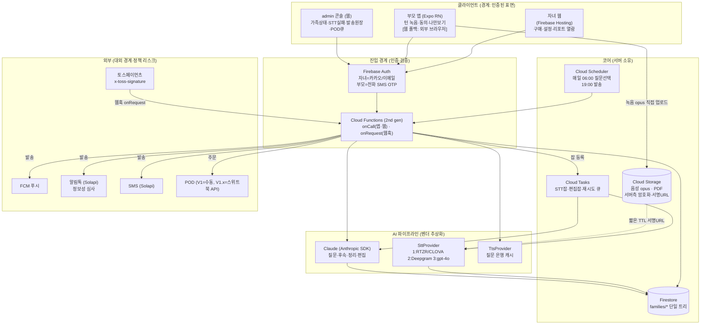

# 하루담 — 기술 구현 아키텍처 (ARCHITECTURE)

작성: BE(테크 리드 모자) · 2026-09-02 · 입력: `TECH_SPIKE.md`(전작) · `PRD.md`(PM) · `BUSINESS_CASE.md`(BD)
용도: **TECH_SPIKE의 실현성 판정을 실제 구현 구조로 전개한다.** 스파이크에서 확정된 것은 참조하고(중복 서술 금지),
여기서는 "무엇을 어디에 두고, 어떻게 두 번 와도 같은 결과가 나며, 틀어지면 어디서 드러나는가"를 정한다.
스택은 팀 플레이북과 같은 **Firebase 계열**로 가정한다. 최신 사양은 2026-09 검색으로 확인했고, 막힌 것은 **[확인 필요]**.
가격 정책·범위·배포 실행은 하지 않는다 — 구조·계약·판정 재료까지다.

---

## 0. 핸드오프 요약

```yaml
status: DONE
summary: "TECH_SPIKE의 B′ 채널(자녀=웹·부모=앱)·턴 기반 녹음·배치 STT·2패스 편집을 Firebase 위의 이벤트 구동 아키텍처로 확정했다. 모든 쓰기 경로는 (1) 자연 멱등키 (2) eventAt 순서 가드 (3) 원인 코드가 붙은 실패 모드를 세트로 갖는다. 막히는 곳은 기술이 아니라 세 곳의 운영 결정이다 — 음성 원본 보관 기본값, 알림톡 정보성 심사 통과 여부, STT 벤더의 학습 미사용 계약."
deliverable: "apps/harudam/docs/ARCHITECTURE.md"
decisions_waiting:
  - "음성 원본 보관 기본값 On/Off (D7·PRD §10-F F1) — 스키마의 audio.retentionPolicy 기본값을 결정한다"
  - "부모 사망 시 데이터 승계 (D10·E3·F2) — 약관·삭제 파이프의 비가역 분기"
  - "STT 1순위 벤더 확정 (S2 실측 후) — SttProvider 구현체 우선순위. 국내(CLOVA/RTZR) vs 국외(Deepgram) 선택이 국외이전 고지·원가·CER를 동시에 가른다"
  - "결제 대행: 토스페이먼츠 직연동 vs 포트원(PortOne) 경유 — 수수료·정산 트레이드오프 (BD §6-1 [확인 필요])"
next: { to: "PM·PO(결정 3건) → 그다음 APP·AI(계약 소비)", what: "§3 데이터 모델·§4 API 계약을 APP/AI가 구현 전 합의, §6 컴플라이언스를 PO가 법률 자문 항목으로" }
assumptions:
  - "스택 Firebase: Firestore·Cloud Functions(2nd gen)·Cloud Storage·Cloud Tasks·FCM·Firebase Auth(전화). 팀 플레이북 정합"
  - "부모 앱=Expo RN(네이티브 녹음), 자녀=웹(Firebase Hosting). PRD 본문 가정 B′를 따른다 — V0가 웹만으로 좁힐 수 있음(§8)"
  - "LLM=Claude(Anthropic SDK). Haiku 4.5·Sonnet 5·Opus 5. 단가는 claude-api 스킬 캐시(2026-06-24)로 재확인, TECH_SPIKE §4와 동일"
  - "결제=토스페이먼츠(자녀 웹). 부모 앱은 판매 없음(IAP 의무 회피). 웹훅 서명 x-toss-signature·최대 7회 재전송 확인"
  - "세션당 원가·모델 등급은 TECH_SPIKE §4 절약안(137원)~국내안(344원) 범위를 그대로 승계"
risk: "고령자 STT CER를 실측 못 했다(S2 대기). 이 수치가 15%를 넘으면 §5의 편집 파이프라인에 '확인 질문' 단계가 추가되고 세션당 턴 수·원가·데이터 모델의 turns 구조가 함께 바뀐다. 두 번째로 약한 곳은 알림톡 정보성 심사(S5) — 거부되면 §4의 발송 파이프가 푸시+SMS 2채널로 축소된다"
```

### 한 줄 결론

**하루담은 "매일 한 번의 음성 세션"을 원자 단위로 삼는 이벤트 구동 시스템이다.** 세션 문서 ID를 부모 로컬 날짜로
고정해 하루 1세션을 멱등키로 만들고, 그 위에 STT·편집·알림·결제·POD가 전부 "두 번 실행돼도 같은 결과"가 되도록
자연 멱등키와 `eventAt` 순서 가드를 건다. 실거래·실세션 하나는 **구조화 로그 한 줄**(`{"type":..,"outcome":"applied|skipped_stale|failed","code":..}`)로
검증된다. 이 구조는 V0(수동 파이프)에서 V2(앱 완성·일본)까지 컬렉션·인터페이스를 바꾸지 않고 살아남도록 설계했다.

---

## 1. 시스템 개요

### 1-1. 구성요소·경계·데이터 흐름



### 1-2. 경계 원칙 (누가 무엇을 통과할 수 있는가)

- **클라이언트는 Firestore를 직접 읽기만 하고, 의미 있는 쓰기는 전부 `onCall` Functions를 통과한다.** 등급·결제·공개범위·
  편집 상태 같은 "돈과 프라이버시가 지나가는" 문서는 클라이언트 쓰기를 보안 규칙에서 원천 차단한다(서버 전용).
- **음성 원본만 예외로 클라이언트가 Storage에 직접 업로드**한다(대용량·오프라인 큐). 대신 경로는 서버가 미리 발급한
  규칙(`families/{id}/sessions/{date}/turns/{turnId}.opus`)만 허용하고, 업로드 완료를 `onCall`로 알려 잡을 등록한다.
- **외부 이벤트(결제 웹훅·STT 콜백·알림 발송 결과)는 순서를 보장하지 않는다** — 전부 §4의 멱등·순서 가드를 거친다.
- **AI·STT·TTS·PG·POD는 모두 벤더 추상화 인터페이스 뒤에 둔다.** 벤더 교체가 데이터 모델·클라이언트 계약을 건드리지 않게.

---

## 2. 컴포넌트별 책임과 경계

### 2-1. 소유·비소유 표

| 컴포넌트 | 소유(책임진다) | 하지 않는다(경계) |
|---|---|---|
| **자녀 웹** | 구매 UI·설정 입력·리포트 열람·부모 초대 트리거 | 원본 음성·전사 열람(부모만) · 등급·결제 상태를 직접 쓰기 · 편집 결과 생성 |
| **부모 앱** | 턴 녹음·로컬 업로드 큐·동의 UI·나만보기 토글·오프라인 재개 | 판매·가격·구매 링크(IAP 회피) · 서버 상태 판정(서버가 진실) · 오류 코드 노출(부모 표면 금지) |
| **admin 콘솔** | 가족 상태·STT 실패 큐·발송 원장·수동 부여·POD 수동 주문 | 등급을 웹훅과 다른 경로로 쓰기(부여는 §4 도장 세트) · 옛 함수 응답에서 죽기(방어적 읽기 필수) |
| **Cloud Functions** | 모든 의미 쓰기·웹훅 수신·잡 오케스트레이션·발송 | 무거운 동기 처리(STT/편집은 Tasks로 비동기) · 순서 가정 |
| **Firestore** | 가족 단위 상태·세션·요약·원장의 단일 진실 | 대용량 바이너리(음성은 Storage) · 내림차순 문서ID orderBy(be-dev 규칙) |
| **Cloud Storage** | 음성 opus·PDF 원본·서버측 암호화 | 공개 접근(서명 URL만) · 무기한 보관(retentionPolicy 따라 삭제) |
| **Cloud Tasks** | STT 잡·편집 잡·발송 재시도의 backpressure·재시도 | 순서 보장(멱등으로 흡수) |
| **AI 파이프라인** | 질문·후속·정리·편집 생성 + 평가셋 게이트 | 원문에 없는 사실 생성(무출처 0% 게이트) · 벤더 종속(추상화 뒤) |

### 2-2. 스택 선택과 트레이드오프

TECH_SPIKE가 Firebase 계열을 가정으로 잡았고(팀 플레이북 정합), 여기서 컴포넌트별로 대안과 비교해 확정한다.

| 결정 | 선택 | 대안 | 트레이드오프 · 왜 이 선택인가 | 마이그레이션·운영 비용 |
|---|---|---|---|---|
| 백엔드 런타임 | **Firebase Cloud Functions 2nd gen** | 전용 서버(Cloud Run 상시)·AWS Lambda | 트래픽이 습관형이라 낮 시간엔 유휴, 저녁 7시에 몰린다 → 서버리스 자동 스케일이 원가·운영 모두 유리. 팀 플레이북(결제·OTA)이 Firebase 전제 | 콜드스타트(저녁 몰림 전 min-instance 예열). 벤더 종속은 SttProvider·PG 추상화로 국소화 |
| 데이터베이스 | **Firestore** | Postgres(Cloud SQL) | 가족 단위 트리·보안 규칙으로 클라이언트 직접 읽기·부모/자녀 권한 분리가 깔끔. 관계형 조인은 거의 없다(가족 안에서만 읽음) | 집계·정산 리포트는 약함 → 원가 계측은 별도 집계 문서 + 검증 스크립트(be-dev 규칙). 급증 시 §8 |
| 부모 클라이언트 | **Expo RN(네이티브 녹음)** | 웹뷰 셸·PWA | TECH_SPIKE Q3·Q4: 인앱 브라우저 마이크 불가, 웹뷰 셸은 심사 4.2 리스크. 네이티브 권한 1회가 시니어 마찰 최소 | 첫 출시 네이티브 빌드(심사 1~2주). 이후 JS는 OTA. 네이티브 모듈은 첫 빌드에 전부(app-dev 규칙) |
| 자녀 클라이언트 | **웹(Firebase Hosting)** | 자녀 앱 | 자녀 앱은 IAP 병행 의무(3.1.3b) 유발. 웹은 즉시 배포·되돌리기 쉬움 | 없음. V2에서 자녀 앱 추가 시 결제만 IAP 파이프 추가(플레이북 그대로) |
| STT | **SttProvider 추상화** (구현체 다수) | 단일 벤더 직결 | 고령자 CER 미실측(최대 리스크) → 벤더 교체가 코드·데이터를 안 건드려야 한다. 국내/국외 선택이 국외이전 고지와 얽힘 | 구현체 추가는 인터페이스 준수만. 폴백 체인으로 벤더 장애 흡수 |
| 결제 | **토스페이먼츠 직연동** (포트원은 [확인 필요] 대안) | 포트원 경유·카카오페이 직결 | 자녀 웹 단일 PG면 직연동이 수수료 최소. 포트원은 멀티PG·정산 편의 대가로 추가 수수료(BD §6-1) | 정기결제(빌링키) 전환 시 웹훅 이벤트만 추가. PG 교체는 PgProvider 뒤 |
| 알림 | **FCM → 알림톡 → SMS 폴백** | 알림톡 단일 | 알림톡 정보성 심사에 리텐션을 걸면 정책 리스크가 사업 리스크(TECH_SPIKE §2). 푸시가 1순위면 심사 막혀도 선다 | 채널 추가는 NotifyChannel 인터페이스. 원장으로 결과 추적 |

---

## 3. 데이터 모델 확정

TECH_SPIKE §5-1 초안을 구현 스키마로 확정한다. **가족 단위 단일 트리**가 원칙 — 자녀 구매가 `families/{familyId}`를
만들고 그 아래 모든 상태가 산다. 등급은 `users`가 아니라 `families`에 도장한다(가족 단위 플랜).

### 3-1. 컬렉션·문서 스키마

```
families/{familyId}                         # 자녀 구매 단위 = 프로그램 단위
  ├ plan: "p1_49000" | ...                  # 상품 코드(카탈로그 키. 등급 직접 비교 금지 — app-dev 규칙)
  ├ status: "pending"|"active"|"paused"|"completed"|"refunded"
  ├ purchasedAt, programStartDate, programLengthDays: 90
  ├ parentTimezone: "Asia/Seoul"            # 부모 로컬 — 세션 날짜 귀속의 기준(E9)
  ├ tierEventAt: <ts>                       # 결제/등급 도장(순서 가드 기준. 플레이북 writeTierIfNewer)
  │
  ├ members/{uid}
  │   ├ role: "child" | "parent"
  │   ├ phoneHash                           # 전화번호는 해시로만(원문 미저장)
  │   ├ displayName, honorific              # 호칭(어머님/성함+님/직접)
  │   ├ consentAt, consentVersion           # 부모 본인 동의 시각(성년자 본인만, D1). 없으면 녹음 불가
  │   └ notifyPrefs: { push, alimtalk, sms, optedOut }
  │
  ├ config/profile                          # 단일 문서. 자녀 입력
  │   ├ keywords: []                        # 듣고싶은 이야기 → 챕터 매핑 입력
  │   ├ wantToHear: []
  │   ├ avoidTopics: []                     # 피해야 할 주제. 배열로 저장(맵 키 점 치환 회피 — be-dev 규칙)
  │   └ boostTerms: []                      # 고유명사 STT 부스팅용(자녀 키워드에서 파생)
  │
  ├ chapters/{chapterId}                    # (a) 챕터 매핑 산출물. chapterId = "ch_01"(제로패딩, 문자열 정렬)
  │   ├ order: 1, title, themes: [], avoid: []
  │   └ status: "pending"|"in_progress"|"done"
  │
  ├ questionBank/{questionId}               # 질문 은행 + TTS 캐시. questionId = "q_0001"
  │   ├ chapterId, order, text
  │   ├ ttsAudioPath, ttsVoiceId            # 미리 만든 TTS 캐시
  │   └ difficulty: "easy"|"normal"         # 첫 3일·복귀는 easy(PRD US-P5·E1)
  │
  ├ sessions/{yyyymmdd}                      # ★ 문서 ID = 부모 로컬 날짜 → 하루 1세션 멱등키(E9)
  │   ├ status: "sent"|"recording"|"partial"|"stt_pending"|"summarized"|"skipped"
  │   ├ questionId, followupCount, startedAt, endedAt
  │   ├ turnCount: <int>                     # 세션 정리 멱등 판정(sessionId+turnCount)
  │   ├ sttStatus: "pending"|"partial"|"done"|"failed"
  │   ├ costWon: { stt, tts, llm }           # 세션별 원가 계측
  │   │
  │   ├ turns/{turnId}                       # ★ turnId = 클라이언트 UUID → 재업로드 no-op
  │   │   ├ seq: <int>                        # 턴 순서(orderBy seq ASC. 문서ID orderBy 금지)
  │   │   ├ audioPath, audioHash             # STT 콜백 멱등키(turnId+audioHash)
  │   │   ├ sttStatus, transcript
  │   │   ├ confidence: [{start,end,score}]  # 구간 신뢰도. 저신뢰는 편집에서 "[잘 안 들렸어요]"
  │   │   ├ sttEventAt: <ts>                  # ★ 순서 역전 가드(writeIfNewer)
  │   │   └ createdAt
  │   │
  │   └ summary/summary                      # (e) 세션 정리 산출물
  │       ├ cleanTranscript                  # 구어체·사투리 보존, 필러만 제거
  │       ├ facts: [{text, sourceTurnId, sourceSpan}]  # 각 항목에 원문 구간 id(무출처 금지)
  │       ├ dailyStory                       # 부모 1인칭. 자녀 리포트 원본
  │       ├ visibility: "child" | "private"  # 나만보기(US-P3) → private면 자녀 리포트·책 제외
  │       └ summaryTurnCount                  # 재실행 판정
  │
  ├ book/{versionId}                         # (f) 자서전 버전. versionId = "v1","v2"
  │   ├ status: "draft"|"parentApproved"|"ordered"|"shipped"
  │   ├ pdfHash                              # 결정론적 PDF(같은 버전=같은 해시 → 재주문 멱등)
  │   ├ pdfPath, chapterVersions: []
  │   ├ approvedAt, orderId, trackingUrl
  │
  ├ cheers/{cheerId}                         # 자녀 응원 1일 1건(US-C3). 다음 인터뷰 도입부에 읽어줌
  │   ├ date, text, deliveredAt
  │
  ├ orders/{orderId}                         # 결제 원장. orderId = 토스 orderId
  │   ├ paymentKey, amount, method, status
  │   ├ eventAt, tierEventAt                 # 웹훅 순서 가드
  │   └ item: "program" | "book"
  │
  └ ledger/{eventId}                         # ★ 발송·시스템 이벤트 원장(멱등 선점)
      # eventId = "{familyId}_{yyyymmdd}_{templateCode}" (발송)
      #        or "{paymentKey}_{eventType}"             (결제)
      ├ type: "ALIMTALK"|"SMS"|"PUSH"|"PAYMENT"|"STT_DONE"|"POD"|"GRANT"
      ├ channel, outcome: "applied"|"skipped_stale"|"failed"|"sent"
      ├ code                                  # 실패 원인 코드(팀 규칙 6)
      └ eventAt, createdAt

users/{uid}                                  # Auth 미러. 등급 없음(가족 단위)
  ├ role, familyId, phoneHash
  └ createdAt

invites/{inviteToken}                        # 부모 초대 매직링크. 단발성
  ├ familyId, parentPhoneHash, expiresAt, usedAt

adminQueue/{queueId}                         # STT 실패·POD 수동·모델 실패 알림
  ├ type, familyId, sessionDate, reason, code, status: "open"|"resolved"
```

### 3-2. 인덱스

| 쿼리 | 인덱스 | 이유 |
|---|---|---|
| 오늘 발송 대상 가족 | `families` where `status==active` + `programStartDate` 범위 | 스케줄러 매일 06:00 배치 |
| 세션 목록(자녀 리포트) | `sessions` orderBy `__name__`(=날짜문자열) **ASC** | 날짜 ID가 곧 정렬키. **내림차순 금지 → ASC로 받아 코드에서 뒤집는다**(be-dev 규칙) |
| 턴 순서 | `turns` orderBy `seq` ASC | 문서ID(UUID) orderBy 금지. `seq` 필드로 정렬 |
| STT 실패 큐 | `adminQueue` where `type==stt_failed` `status==open` | admin 콘솔 |
| 미답 세션 복귀 판정(E1) | `sessions` where `status==skipped` 최근 N일 | 4일째 복귀 알림 |

### 3-3. 보안 규칙 원칙 (permission-denied가 정당한 케이스)

> 규칙의 목적은 "돈과 프라이버시가 지나가는 문서를 클라이언트가 못 쓰게" 하는 것이다. 아래 거부는 **정당한 permission-denied**이고,
> 클라이언트는 이를 오류가 아니라 설계된 경계로 다룬다(부모 표면엔 코드 노출 금지).

| 경로 | 자녀(child) | 부모(parent) | 서버(Functions) | 정당한 거부 |
|---|---|---|---|---|
| `families/{id}` (plan·status·tierEventAt) | read only | read only | read/write | 클라이언트 write → **denied**(등급 위조 차단) |
| `config/profile` (avoidTopics 포함) | read/write(프로그램 시작 전) | **denied** | read/write | 부모가 avoidTopics write → **denied**(자녀 소유 설정) |
| `sessions/*/turns/*` (원본·전사) | **denied** | read/write(본인 가족) | read/write | 자녀가 turns 읽기 → **denied**(원본 음성·전사는 부모만, PRD §6-2·C3) |
| `sessions/*/summary` visibility=private | **denied** | read | read/write | 자녀가 private 요약 읽기 → **denied**(나만보기, US-P3) |
| `sessions/*/summary` visibility=child(dailyStory) | read | read | write | — (자녀 리포트) |
| `book/{v}` status<parentApproved | **denied** | read/write | write | 자녀가 미승인 초안 읽기 → **denied**(내용 주권은 부모, US-S4) |
| `orders`·`ledger` | **denied** | **denied** | read/write | 모든 클라이언트 write → **denied**(원장은 서버만) |
| Storage `turns/*.opus` | **denied** | 본인 업로드/서명URL read | 서명URL 발급 | 자녀가 음성 접근 → **denied** |

DoD: 위 거부 케이스는 에뮬레이터 규칙 테스트로 **실제로 permission-denied가 나는지** 확인한다(be-dev DoD). 동의 전 부모의
녹음 업로드도 거부한다(`consentAt` 없으면 Storage write denied — D1 "동의 전 녹음 버튼 없다"를 규칙으로도 이중 방어).

### 3-4. be-dev 규칙 준수 체크

- **문서 ID 내림차순 orderBy 금지** → 세션은 날짜 문자열 ID를 ASC로 받아 코드에서 뒤집는다(§3-2).
- **맵 키 점 치환** → `avoidTopics`·`keywords`는 맵이 아니라 **배열**로 저장. 부득이 맵이 필요하면 점을 밑줄로(`context.long`→`context_long`).
- **turnId = 클라이언트 UUID** → 재업로드가 같은 문서를 덮어써 no-op(멱등).
- **tierEventAt 도장** → 결제·수동부여 모두 같은 도장. 수동부여가 웹훅에 되덮이지 않게(§4).

---

## 4. API·인터페이스 계약

주요 엔드포인트/Functions와, 각 쓰기 경로의 **멱등 보장 방식 + 실패 모드 표**를 계약으로 못 박는다. 성공 예시만 쓰지 않고
"무엇이 언제 실패하고 클라이언트가 무엇을 받는가"를 원인 코드와 함께 적는다(be-dev DoD·팀 규칙 6).

### 4-1. 엔드포인트 목록

| # | Function | 유형 | 호출자 | 하는 일 |
|---|---|---|---|---|
| F1 | `purchaseWebhook` | onRequest | 토스페이먼츠 | 결제 상태 웹훅 → 가족 활성화·등급 도장 |
| F2 | `createFamilyAndInvite` | onCall | 자녀 웹 | 결제 확정 후 가족 생성·부모 초대 발송 |
| F3 | `verifyParentOtp` | onCall | 부모 앱/웹 | SMS OTP 검증 → 매직링크 세션 |
| F4 | `submitConsent` | onCall | 부모 앱 | 본인 동의(음성+텍스트) 저장·사본 카톡 |
| F5 | `mapChapters` | Task | 스케줄러(설정 완료 시) | (a) 키워드→챕터 구조·질문 은행·TTS 캐시 |
| F6 | `selectDailyQuestion` | Scheduler 06:00 | 시스템 | (b) 오늘 질문 선택·후속 준비 |
| F7 | `dispatchDaily` | Scheduler 19:00(부모 로컬) | 시스템 | 발송(푸시→알림톡→SMS) |
| F8 | `registerTurn` | onCall | 부모 앱 | 업로드 완료 알림 → STT 잡 등록 |
| F9 | `sttCallback` | onRequest/Task | STT 벤더/큐 | (c) 전사 결과 수신 |
| F10 | `generateFollowup` | onCall | 부모 앱 | (d) 턴 사이 후속 질문 |
| F11 | `summarizeSession` | Task | 세션 종료 트리거 | (e) 세션 정리 3종 산출 |
| F12 | `buildBook` | Task | 완주 트리거 | (f) 챕터 편집→PDF 초안 |
| F13 | `approveBook` | onCall | 부모 앱 | 부모 승인 → 자녀 공개·POD 큐 |
| F14 | `grantManual` | onCall(admin) | admin | 수동 등급 부여(도장 세트) |

### 4-2. 쓰기 경로 멱등 + 실패 모드 표 (계약의 핵심)

| 쓰기 경로 | 멱등 키 | 순서 역전 가드 | 실패 모드 → 클라이언트가 받는 것(원인 코드) |
|---|---|---|---|
| **F1 결제 웹훅** → `orders/{orderId}`·`families.status` | `paymentKey + eventType` (ledger 선점) | `eventAt` 도장 + **`writeTierIfNewer`**(플레이북). 늦게 온 낡은 이벤트 무시 | 서명 검증 실패 `payment.verify_failed (bad_signature)` → **200 응답하되** 원장 기록·admin 알림(재전송 방지). 자녀 화면 "결제 확인 중" · Payment.secret 불일치 `payment.secret_mismatch` |
| **F2 가족 생성** → `families/{id}` | `orderId`(가족당 1) | — (선점) | 이미 존재 `family.exists` → 기존 반환(더블탭 흡수). 결제 미확정 `family.payment_pending` → 자녀 "결제 확인 후 시작" |
| **F4 동의** → `members/{uid}.consentAt` | `uid + consentVersion` | `consentAt` 최초만 기록 | 저장 실패 `consent.save_failed (network)` → 부모 앱 재시도, 동의 전엔 녹음 버튼 없음(규칙+UI 이중) |
| **F8 턴 업로드** → `turns/{turnId}` | **클라이언트 UUID**. 재업로드 no-op | 없음(턴은 append, `seq`로 정렬) | 업로드 실패 `turn.upload_failed (network)` → 로컬 큐 재시도, 화면 "저장 중"(코드는 로그에만) |
| **F9 STT 콜백** → `turns/{turnId}` | `turnId + audioHash` | **`writeIfNewer`** (`sttEventAt`). 콜백 2회·역전 시 낡은 결과 무시 | 벤더 5xx `stt.failed (vendor_5xx)` → 백오프 3회 → 다음 벤더 폴백 → 실패면 adminQueue·자녀 요약 "정리 중" |
| **F11 세션 정리** → `summary/summary` | `sessionId + turnCount` | 같은 턴 수 재실행이면 덮지 않음. 새 턴 추가되면 재실행(뒤가 이김) | LLM 오류 `summary.llm_failed` → 재시도 큐. 부모 화면 영향 없음, 자녀 요약 "정리 중" |
| **F7 발송** → `ledger/{familyId_date_template}` | `familyId + date + templateCode` 선점 후 발송 | 스케줄러 중복 실행 시 원장 존재로 차단 | 채널 실패 코드(`alimtalk.rejected`·`sms.invalid_number`) → 다음 채널 폴백(푸시→알림톡→SMS), 원장에 outcome. 하루 2회 상한 코드 강제(PRD §5-1) |
| **F12 자서전** → `book/{versionId}` | `versionId`(챕터셋 해시) | 같은 버전 재실행 = 같은 pdfHash | 편집 게이트 위반(무출처>0) `book.unsourced_detected` → 자동 삭제 후 재편집, 통과 못하면 adminQueue |
| **F13 POD 주문** → `book.status=ordered` | `pdfHash`(=주문 번호) | 같은 버전 재주문 차단 | 주문 API 실패 → 수동 주문 큐(admin). V1은 처음부터 수동(X9) |
| **F14 수동 부여** → `families.tier*` | ledger 기록 + 같은 `eventAt` 도장 | **웹훅이 되덮지 않음**(도장 일원화) | — |

로그: 모든 경로가 `{"type":"STT_DONE","familyId":..,"sessionId":..,"outcome":"applied|skipped_stale|failed","code":..}` 한 줄.
실거래·실세션 검증은 이 한 줄로 끝난다(be-dev DoD·SRE 구조화 로그).

### 4-3. 결제 웹훅 상세 (플레이북 + 2026-09 확인)

토스페이먼츠 웹훅은 **순서를 보장하지 않고, 10초 내 2xx가 없으면 최대 7회 재전송**한다(2026-09 확인). 그래서:
1. `x-toss-signature` 헤더를 서명 Secret으로 검증(위변조 차단). 실패해도 **200 반환**하되 원장에 남긴다(재전송 폭주 방지).
2. Payment 객체의 `secret`이 저장값과 같은지 대조(위장 요청 차단).
3. `ledger/{paymentKey_eventType}` 선점으로 중복 무해화 → `writeTierIfNewer`로 순서 역전 방어.
4. 부모 앱은 아무것도 팔지 않으므로 IAP 웹훅 파이프는 V1에 없다(TECH_SPIKE §6-1). 자녀 앱이 생기면 그때 플레이북(RevenueCat·`writeTierIfNewer`) 그대로 붙인다.

### 4-4. PRD 엣지케이스 E1~E15 커버 대조표

| 엣지 | 커버하는 구조 |
|---|---|
| E1 무응답 N일 | `sessions.status=skipped` + §3-2 복귀 쿼리 → 4일째 F7 저강도 1회(하루 2회 상한) |
| E2 그만두고 싶어함 | F10 후속 생성 시 "그만/싫어" 감지 → 세션 즉시 저장·종료. `status=paused` 옵션 |
| E3 부모 사망 | `status=paused` 즉시, 발송 전면 중단. 승계는 **decisions_waiting**(F2 PO 결정) |
| E4 자녀 환불 | 14일 내 온보딩 실패 판정(첫 세션 미완료) → F1 환불 웹훅 → `status=refunded` → D9 삭제 흐름 |
| E5 형제 중복 구매 | F2에서 `parentPhoneHash`로 기존 활성 가족 탐지 → `family.duplicate_parent` 경고·환불 권장 |
| E6 피해야 할 주제 위반 | F6/F10 하드+소프트 필터 + F12 편집 제외. 누출 0 게이트 |
| E7 STT 오인식 | `confidence` 저신뢰 구간 → 편집에서 "[잘 안 들렸어요]"(추측 금지). `boostTerms` 부스팅 |
| E8 침묵 녹음 | 부모 앱 VAD(8초 안내·20초 종료). 빈 턴은 `seq` 미증가·세션에 안 셈 |
| E9 타임존/해외 자녀 | 세션 ID = **부모 로컬 날짜 문자열**(UTC 계산 금지). `parentTimezone` 기준 |
| E10 번호 변경 | F3 새 번호 OTP 재인증 → `members.phoneHash` 갱신, 가족 재연결 |
| E11 기기 변경 | 앱 재설치→OTP, 로컬 미업로드 큐 재업로드(turnId 멱등). 웹은 매직링크 재발급 |
| E12 중간 결제 실패 | 일회성 선결제라 중간 결제 없음. 책 업셀만 별도 F1 — 실패 코드 노출·프로그램 계속 |
| E13 앱 설치 실패 | 웹 폴백(외부 브라우저 강제). 웹도 실패 시 자녀에게 "옆에서 도와주세요"(R13) |
| E14 모르는 번호 무시 | 발신 채널명 고정·첫 알림톡 "지영 씨가 신청" 신뢰 신호. 자녀 동석 온보딩 |
| E15 세션 과금 폭주 | 부모 앱 발화 8~10분 상한 → "내일 이어서". `costWon`으로 세션별 계측·상한 알림 |

---

## 5. AI 파이프라인 구현

TECH_SPIKE §4의 (a)~(f) 파이프를 구현 관점으로 확정한다. 파이프 그림·단계별 요점·가드레일·평가셋은 §4 참조 — 여기서는
**벤더 추상화·잡 오케스트레이션·모델 폴백·모니터링**을 정한다.

### 5-1. 벤더 추상화 인터페이스

```
interface SttProvider {
  transcribe(audioUri, opts:{boostTerms, lang:"ko"}) -> {segments:[{text,start,end,confidence}], vendor}
}
// 구현: RtzrProvider, ClovaProvider, DeepgramProvider, OpenAiProvider  (§ 폴백 체인)

interface LlmProvider {          // Anthropic SDK 감싼다
  complete(system, messages, model, opts) -> {text, usage}
}

interface TtsProvider { synth(text, voiceId) -> audioUri }        // 질문 은행 캐시
interface NotifyChannel { send(to, template, vars) -> {outcome, code} }  // FCM/Alimtalk/SMS
interface PgProvider { verifyWebhook(req) -> event; ... }         // 토스/포트원 교체
```

원칙: **벤더 교체가 데이터 모델·클라이언트 계약을 건드리지 않는다.** STT 1순위 벤더는 S2 실측 후 결정(decisions_waiting).

### 5-2. LLM 모델 선택·폴백

단가는 claude-api 스킬 캐시(2026-06-24)로 재확인 — TECH_SPIKE §4와 동일(Haiku 4.5 $1/$5, Sonnet 5 $2/$10, Opus 5 $5/$25 per MTok).

| 단계 | 1순위 모델 | 폴백 | 근거 |
|---|---|---|---|
| (a) 챕터 매핑 | Sonnet 5 (구조화 출력) | Opus 5 | 1회성, 구조 고정. 스키마 `output_config.format` |
| (b) 일일 질문 재랭킹 | Haiku 4.5 | 규칙 폴백(은행에서 선택) | 저비용·저지연. LLM 실패해도 은행이 답 |
| (d) 후속 질문 | Haiku 4.5(캐시 프리픽스=금지주제) | 예비 질문 은행 | 100토큰·1개·유도 금지 |
| (e) 세션 정리 | Sonnet 5 | Opus 5(품질 필요 시) | 사실 카드·구어체 보존 |
| (f) 챕터 편집 | Opus 5 (2패스) | — | 긴 컨텍스트·문체. 무출처 문장 자동 삭제 |

- **음성을 LLM에 직접 넣지 않는다** — Claude는 2026-09 오디오 입력 없음(TECH_SPIKE §4-2). STT 전사만 넣는다.
- **금지 주제는 시스템 프롬프트 캐시 프리픽스**로 모든 호출에 상주(캐시 히트로 원가 절감).
- Anthropic SDK는 `claude-opus-5` 계열에 refusal 폴백(`fallbacks`)을 기본 켜는 것을 권고 — 편집 파이프가 조용히 멈추지 않게.

### 5-3. 잡 오케스트레이션 (비동기·재시도)

STT·편집은 무거워서 `onCall` 안에서 동기 처리하지 않고 **Cloud Tasks**에 넣는다. Cloud Functions는 at-least-once 전달이라
**잡은 두 번 실행될 수 있다**(2026-09 확인) → §4의 멱등키로 흡수. 재시도는 지수 백오프 3회 후 adminQueue.

```
F8 registerTurn → Tasks(sttJob) → F9 sttCallback(멱등:turnId+audioHash)
세션 종료 → Tasks(summarizeJob) → F11(멱등:sessionId+turnCount)
완주 → Tasks(bookJob) → F12(멱등:versionId)  → 무출처 검출기 게이트 → adminQueue|승인대기
```

### 5-4. 평가셋·모니터링

- 평가셋 게이트(TECH_SPIKE §4-4): **무출처 문장 0%**·사실 재현율 90%↑·금지주제 누출 0·질문 자연스러움 4.0↑·고령자 CER 12%↓.
  무출처 검출기는 F12 파이프에 인라인(게이트 미통과 시 배포 아니라 자동 삭제·재편집).
- 모니터링: 세션별 `costWon` 집계 → 월간 원가 상한 알림. STT 실패율·마이크 실패율·완주율은 구조화 로그에서 집계.
- **원가 재확인(TECH_SPIKE §4-5 승계)**: 세션 절약안 137원(Deepgram+캐시TTS+Haiku/Sonnet)~국내안 344원(CLOVA+Sonnet).
  90일 12,300~31,000원. 49,000원 대비 원가 25~70%. 세션 길이·STT 벤더·모델 등급이 3개 레버(§8 급증 대비).

---

## 6. 보안·프라이버시·컴플라이언스

TECH_SPIKE §5·PRD §6·BUSINESS_CASE §8을 구현 제약으로 확정한다.

| 영역 | 구현 제약 | 근거 |
|---|---|---|
| 음성=개인정보 | Storage 서버측 암호화·짧은 TTL 서명 URL. 접근은 전부 로깅(누가·언제·어느 세션). **화자인식·목소리 복제 미탑재**(생체정보 회피) | R1·D5·C1 |
| 보관·삭제 | 기본 자서전 확정 후 90일 → 자동 삭제(전사·편집본 유지). 보관 기본값 **On/Off는 decisions_waiting**. 삭제 요청 시 가족 문서 익명화·오디오 즉시 파기 | D7·D9·F1 |
| 반출 | ZIP(오디오+전사+PDF) — Storage 서명URL 묶음 생성 | D9 |
| 동의 모델 | 부모 본인만(성년자, 자녀 대리 불가). `consentAt` 없으면 Storage 녹음 write **규칙에서 거부**. 동의 음성+텍스트, 사본 카톡 | D1·D2·C2 |
| 공개 모델 | 기본 최소공개. 자녀는 dailyStory(visibility=child)·자서전(승인 후)만. 원본·전사·private는 **denied**(§3-3) | C3·§6-2 |
| 고령자 인증 | 전화번호+SMS OTP 1회 → 매직링크 90일 세션. **익명 인증 안 씀**(플레이북 30일 자동삭제 사고 회피). 기기 변경 시 OTP 재인증 | D·TECH_SPIKE §5-3 |
| 국외 이전 | Deepgram·OpenAI·Google STT는 국외 처리 → 처리방침 국외이전 고지. 국내만: CLOVA/RTZR(원가↑). **벤더 학습 미사용 조항 계약 전 확인** | D6·D8·R11 |
| 알림톡 정보성 | "오늘의 질문"=서비스 이용 알림으로 심사. 부모 수신 동의·자녀 구매→부모 수혜 구조를 템플릿에 설명. 응원·리워드는 알림톡 금지(광고성)→푸시만 | C6·R4·X14 |
| 결제 경계 | 자녀 웹 PG(토스). 부모 앱 판매 없음→IAP 의무 없음. 자녀 앱 생기면 3.1.3(b) IAP 병행 | TECH_SPIKE §6-1 |
| 민감정보 마스킹 | 주민번호·계좌·주소 패턴 전사 단계 정규식 마스킹 후 저장 | D11 |
| AI 저작권 | 부모 구술=부모 저작물. 편집본 저작권 부모(·자녀) 귀속, 회사는 라이선스만 | R7 |

**부모 표면 오류 코드 노출 0**(가드레일): 원인 코드는 자녀 화면·admin·로그에만. 부모에겐 "저장 중"·"정리 중" 같은 상태어만.

---

## 7. 배포·운영

### 7-1. 배포 경로·주체 (판정 문자열 포함)

| 대상 | 경로 | 판정 | 주체 |
|---|---|---|---|
| 서버(Functions·규칙·인덱스) | `firebase deploy` — **CI에서 배포 가능한 구조**(배포 인증=CI 시크릿) | `firebase deploy` 성공 로그의 함수별 `Successful update operation`(**`Skipped`면 안 나간 것**) | CI(권장) 또는 PO 맥. 로컬 배포면 **`git pull` 먼저**(옛 소스 배포 사고 회피) |
| 자녀 웹 | Firebase Hosting 배포 — 즉시·되돌리기 쉬움 | 배포 후 커밋 해시 스탬프 대조 | CI |
| 부모 앱 | 첫 출시 네이티브 빌드(심사 1~2주). 이후 JS는 **EAS OTA** | 번들에 커밋 해시(7자) 스탬프 → 설정 화면 노출·`git log` 대조. OTA는 2회차 적용 | RM 경유 PO(빌드 예산·심사) |

- 네이티브 모듈(expo-audio·푸시·keep-awake)은 **첫 빌드에 전부** 넣고 이후 추가 회피(app-dev·OTA 플레이북).
- 컨테이너/CI에서 인증 부재로 안 되는 배포는 **PO 맥 절차로 문서화**(한 줄에 명령만, 주석 금지 — 팀 규칙 5).
- **admin 콘솔은 옛 함수 응답에서도 살아남는다** — 새 필드를 방어적으로 읽는다(호스팅·함수 별도 배포, be-dev 규칙).

### 7-2. 환경 분리·관측·백업

- 환경: dev/staging/prod 프로젝트 분리. STT·LLM·PG는 staging에서 테스트 키. 결제 검증은 **깨끗한 상태에서 시작**(플레이북).
- 관측: 구조화 로그(§4-2) → 실거래 1건 = 로그 1줄. `costWon` 집계 → **비용 상한 알림**(월 원가가 세션×단가 예상을 넘으면).
- 정산·사용량 문서는 **에뮬레이터 기반 검증 스크립트로 보호**(누적 정확성·문서 공존 — be-dev 규칙).
- 백업: Firestore 일일 내보내기. 음성은 보관정책 대상이라 백업에서 제외(삭제권 보장).

---

## 8. 리스크·마이그레이션·실행 순서

### 8-1. 단계별로 세우는 인프라 (무엇부터 만드는가)

| 단계 | 세우는 인프라 | 안 세우는 것 |
|---|---|---|
| **V0(수동 파이프)** | Storage 업로드·SttProvider 2벤더 병렬 저장·(e) 정리·admin 시트. 결제·알림톡·책 **없음**. 알림은 SMS/사람 | 자동 발송·결제·앱. S1·S2·S4 스파이크를 여기서 소화 |
| **V1** | `families` 트리 전체·F1~F13·벤더 추상화·평가셋 게이트·구조화 로그·부모 앱(네이티브)·자녀 웹·결제·알림 3채널·PDF 초안. 책=수동 POD | 실시간·전화·자녀앱·POD 자동화·일본·목소리 보관 |
| **V1.x** | AI 전화(PSTN, PgProvider와 별개 VoiceProvider 추상화)·C안 리워드(에스크로)·30일 코스·POD 반자동·목소리 보관 옵션·백그라운드 녹음 | — |
| **V2** | 자녀 앱(IAP 파이프)·형제 공동구매·실시간 대화·앱테크 채널·일본(채널·언어 설정값) | — |

**설계 원칙**: V0~V2가 컬렉션·인터페이스를 바꾸지 않는다. 채널·언어·전화는 `families`의 설정값(`parentTimezone`·향후 `locale`·`channel`)으로
두어 일본·전화 확장이 스키마 마이그레이션 없이 켜지게 한다(TECH_SPIKE Q15).

### 8-2. 확장(급증) 대비

- **저녁 몰림**: 19:00 발송·녹음·STT가 몰린다 → 발송은 Cloud Tasks로 분산 발사, Functions는 min-instance 예열, STT는 배치 큐.
- **성공의 역설(원가↑)**: 습관형이라 잘될수록 세션이 는다(R12) → 세션 발화 상한(8~10분)·모델 등급 라우팅·세션별 `costWon` 상한 알림.
- **Firestore 급증**: 가족 단위 트리라 샤딩 자연스러움(familyId가 파티션). 집계·정산만 별도 롤업 문서로 뺀다.
- **STT 벤더 장애**: 폴백 체인(1→2→3순위)으로 흡수. 한 벤더 장애가 파이프를 세우지 않는다.

### 8-3. 마이그레이션·데이터 안전

- 스키마 변경 시 **모든 소비자(APP·자녀 웹·admin)와 계약 문서 갱신**(be-dev DoD). 이 문서가 그 계약의 원본.
- **데이터 삭제·마이그레이션은 PO 승인 필수**(be-dev 권한 경계). 삭제 요청·사망 승계는 비가역 → decisions_waiting.

---

## 9. 참고 출처

결제·전달 보장 (2026-09 확인)
- 토스페이먼츠 웹훅(x-toss-signature·10초 2xx·최대 7회 재전송): https://docs.tosspayments.com/resources/glossary/webhook · https://docs.tosspayments.com/reference/using-api/webhook-events
- Firebase Cloud Functions 재시도·멱등(at-least-once·event ID 멱등키·트랜잭션): https://firebase.google.com/docs/functions/retries · https://firebase.google.com/docs/functions/task-functions

스택·클라이언트
- expo-audio·OTA·빌드: `docs/PLAYBOOKS/OTA_AND_BUILDS.md` · TECH_SPIKE §9(웹·앱 녹음)
- 결제 파이프·writeTierIfNewer·익명 인증 사고: `docs/PLAYBOOKS/PAYMENTS_IAP.md`

AI·STT·원가
- LLM 단가: claude-api 스킬 캐시(2026-06-24) — Haiku 4.5 $1/$5·Sonnet 5 $2/$10·Opus 5 $5/$25 per MTok
- STT·TTS·실시간 벤더 단가·벤치: TECH_SPIKE §4·§9(한국어 STT 벤치마크·CLOVA·RTZR·Deepgram)

입력 문서 (재검증 불필요, 참조)
- `apps/harudam/docs/TECH_SPIKE.md`(전작·판정) · `PRD.md`(범위·엣지·정책) · `BUSINESS_CASE.md`(원가·리스크)

---

## 부록 A. 자기 채점 (10점 만점)

| 항목 | 점수 | 9점 미만 이유 |
|---|---|---|
| 시스템 개요가 구성요소·경계·데이터 흐름을 담고 권고 채널(B′)과 정합 | 9 | — |
| 컴포넌트별 소유·비소유·스택 트레이드오프·마이그레이션 비용 | 9 | — |
| 데이터 모델이 구체 스키마·인덱스·보안 규칙·be-dev 규칙까지 | 9 | — |
| API 계약이 멱등 보장+실패 모드 표(원인 코드)를 세트로 | 9 | — |
| 웹훅 순서 역전 가드·결제 상세 최신 확인 | 9 | — |
| AI 파이프라인 구현(추상화·폴백·잡·평가셋·원가) | 8 | STT 1순위 벤더가 S2 실측 전이라 미정. 폴백 체인으로 흡수하되 원가·CER 확정치는 대기 |
| 보안·프라이버시·컴플라이언스 | 9 | 사망 승계·보관 기본값 PO 결정 대기(비가역) |
| 배포·운영(경로·판정 문자열·관측) | 9 | — |
| 리스크·마이그레이션·실행 순서(V0~V2·급증 대비) | 9 | — |
| 엣지 E1~E15 커버 대조표 | 9 | — |
| **총점** | **8.9** | 9점 미달의 유일한 원인은 §5 STT 벤더 확정과 §6 보관·승계 결정이 실측·PO 판단 대기라는 것. 둘 다 구조는 교체·변경을 흡수하도록 추상화·설정값으로 열어 뒀고, 확정치만 스파이크·PO가 메운다. 구조 자체는 9점 이상으로 판단한다 |

목표 9/10 대비 8.9 — 미달분은 **외부 미확정(벤더 실측·PO 결정)**이지 설계 결함이 아니다. 확정 즉시 §5-1·§6·decisions_waiting에 값만 채우면 9를 넘는다.
