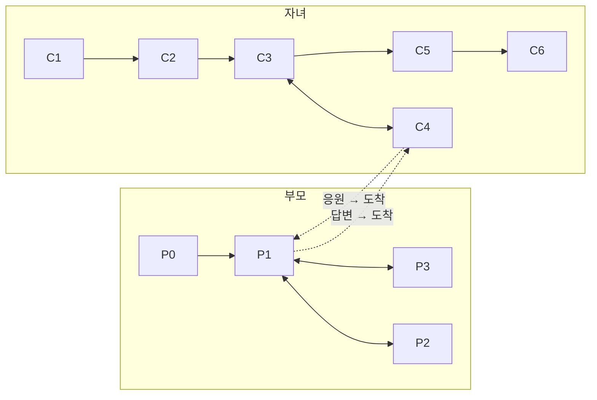
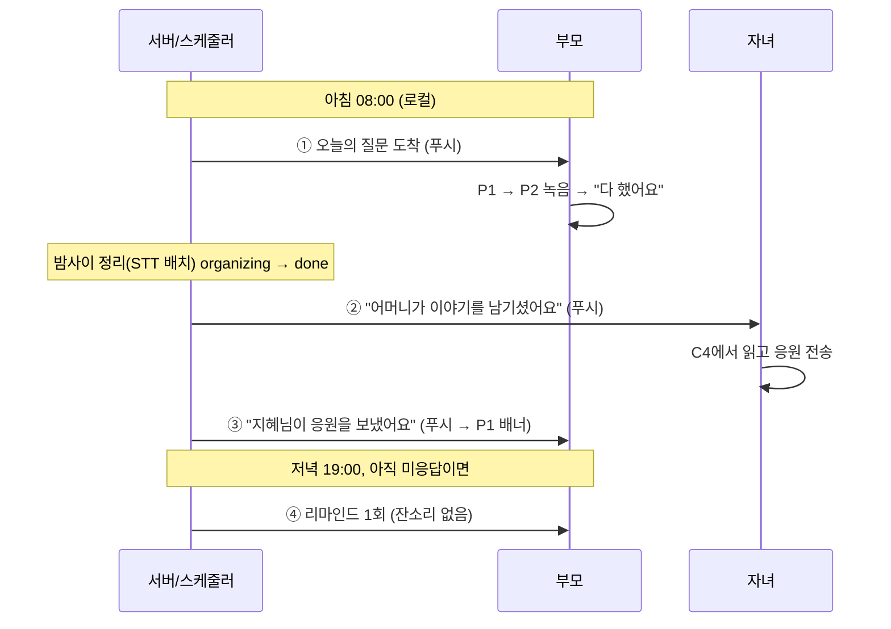

# APP 개발 프로세스 — 하루담(가칭)

> 작성: APP · 2026-08-29 · 제품 **하루담**(가칭)
>
> **이 문서는 구현 근거다.** 화면·상태·카피의 원본은 `PRD.md §9`, 구조는 `IA.md`,
> 브랜드·워딩은 `BRAND.md`다 — 어긋나면 그 문서가 이긴다. 여기서는 **실제로 만든 앱
> 코드**(`apps/senior-diary/app/`)를 근거로 ① 역할별 접근 포인트·플로우 ② 일별 반응
> 피드백 & Push ③ APP 개발 프로세스를 정리한다. 구현/스텁/미구현을 **정직히** 구분한다.
>
> 근거 코드: `app/src/app/**`(라우트) · `app/src/state/StoreProvider.tsx`(상태) ·
> `app/src/services/**`(저장소·파이프라인) · `app/src/domain/**`(타입·뷰) ·
> `app/README.md`(실행·검증·배포 경로).

---

## 0. 스택·레이어 개요

| 레이어 | 무엇 | 파일 |
|---|---|---|
| **런타임** | RN 0.86 · Expo SDK 57(managed) · Expo Router(파일 기반) · TypeScript | `app.config.ts`·`package.json` |
| **라우트/화면** | 부모 4 + 자녀 6 + 랜딩 + 점검 인덱스. 화면은 토큰·셀렉터 훅만 소비 | `src/app/**` |
| **상태(권위)** | 한 기기에서 부모·자녀가 공유하는 단일 로컬 스토어 + 화면용 셀렉터 훅 | `src/state/StoreProvider.tsx` |
| **저장소 seam** | `DiaryRepository` 인터페이스 하나가 로컬↔실서버를 가른다(주입) | `src/services/repository.ts`·`index.ts` |
| **파이프라인** | 밤사이 정리(STT)·분기 룰·책 조립 — 화면과 분리된 순수 로직 | `src/services/pipeline/**` |
| **도메인/시드** | 개체 타입·뷰 프로젝션·질문 뱅크·챕터 시드(목 데이터) | `src/domain/**`·`src/data/seed/**` |
| **디자인 토큰** | 색·타이포·간격(DESIGN_SYSTEM+BRAND §4). 하드코딩 금지 | `src/theme/**` |

**핵심 원칙:** 화면은 저장 방식을 모른다. `DiaryRepository`가 유일한 경계라 로컬
(AsyncStorage) → 실서버(Firestore) 이관 시 바꾸는 것은 구현체 한 줄(`services/index.ts`)뿐이다.
서버·비용에 손대는 부분은 BE 소유, 화면·토큰·배포 경로 판정은 APP 소유.

---

## 1. 역할별 접근 포인트 · 플로우

IA §1의 "하나의 앱, 두 개의 세계"를 코드로 구현했다. **역할은 스스로 고르지 않는다 —
진입 경로가 곧 역할이다**(IA §1-1). 역할 선택 화면은 없다.

### 1-1. 진입점 · 인증 (부모 익명 / 자녀 계정)

| 진입점 | 누가 | 도착 라우트 | 인증 모델 |
|---|---|---|---|
| **G1 랜딩 → 사전예약** | 미래의 자녀(구매자) | `/landing` (연락처 수집만) | 없음(제품 밖) |
| **자녀 신청** | 자녀 | `/child/profile` (C1) → 자녀 세계 | **계정**(구매·관리 주체) |
| **자녀 초대 링크** | 부모 | `/parent/invite` (P0) → 부모 세계 | **익명**(초대 코드 바인딩, 원터치 = 로그인) |

부모/자녀 인증 비대칭은 R3(시니어 온보딩 장벽) 설계다 — 부모는 회원가입·비밀번호
없이 "누르기만", 자녀가 대리 설정(IA §1-2). 코드상 가족 활성화는
`StoreProvider.activateFamily()`(P0 완료 이벤트 시뮬레이트), 재발급은 `reissueInvite()`.

### 1-2. 라우트 맵 (코드 ↔ 파일)

```
공용
  /                     점검용 인덱스(둘러보기) — ⚠️ 개발/점검 전용, 프로덕션 진입과 별개
  /landing              G1 랜딩·사전예약
부모 세계  (src/app/parent/ — 탭바·햄버거 없음, 보이는 버튼만)
  /parent/invite        P0 초대 진입(1회)   → today
  /parent/today         P1 오늘(홈) ★       ⇄ record / archive
  /parent/record        P2 녹음(전체화면 오버레이)
  /parent/archive       P3 지난 이야기
자녀 세계  (src/app/child/ — 일반 모바일 관례)
  /child/profile        C1 신청·프로필(2단계) → invite-wait
  /child/invite-wait    C2 초대 보내기·대기   → home(부모 활성화 시)
  /child/home           C3 홈 ★              ⇄ story · library(하단 내비)
  /child/story          C4 이야기 읽기·응원 ★
  /child/library        C5 모아보기(서재)     → book
  /child/book           C6 책 미리보기
```

### 1-3. 핵심 반복 동선

- **부모(단순함이 곧 설계):** P0(1회) → 이후 매일 **P1**만 연다. 질문을 보고 녹음 버튼
  하나 → P2에서 말하고 "다 했어요" → P1이 "밤사이 정리" 상태로 바뀐다. 응원·정리본은
  **새 화면이 아니라 P1의 상태**로 들어온다. 분기가 거의 없다(§9-5: 화면당 주 행동 1개).
- **자녀(피드백 루프):** C1 신청 → C2 초대 발송·대기 → (부모 활성화) → **C3 홈**에서
  오늘 상태 확인 → **C4**에서 정리된 글·엄마 목소리 읽고 **응원 전송** → C5 서재에서
  "쌓인 이야기" 진행감 → C6 책 미리보기.



두 세계를 잇는 유일한 선은 **상대의 행동으로 발생하는 전이**(굵은 점선)다 — 이게 제품의
심장(피드백 루프 I4). 코드상 이 전이는 `StoreProvider`가 한 기기 안에서 상태로 구현하고,
실제 크로스기기 도달(푸시)은 §2에서 다룬다.

---

## 2. 일별 반응 피드백 & Push (하루 사이클)

하루담의 지속(G2)은 **"상대의 반응이 오늘 도착한다"**는 감각에서 나온다. 그 도달을
하루 시간축의 4개 이벤트로 설계한다.

### 2-1. 하루 사이클 (시간축)



### 2-2. 이벤트별 명세

| # | 이벤트 | 트리거 | 수신자 | 채널(권장) | 문구 방향(BRAND) | 실패/재시도 |
|---|---|---|---|---|---|---|
| ① | 아침 질문 | 매일 아침 정해진 시각 | 부모 | **로컬 반복 알림**(서버 불필요·오프라인 OK) | "오늘의 이야기가 도착했어요" — 재촉 아님, 초대의 언어 | 로컬이라 실패 개념 적음. 답한 날은 표시만 |
| ② | 답변 도착 | 답변 상태 `organizing→done`(정리 완료) | 자녀 | **원격 푸시**(크로스기기) | "{부모}가 오늘 이야기를 남기셨어요" | Expo receipt 확인, 미등록 토큰 제거, 오프라인 큐잉 |
| ③ | 응원 도착 | 자녀 응원 생성(`cheer` 쓰기) | 부모 | **원격 푸시** → P1 배너 | "{자녀}님이 응원을 보냈어요"(자녀가 쓴 그대로) | ②와 동일 |
| ④ | 저녁 리마인드 | 저녁 시각에 `daily.status==='new'`(미응답) | 부모 | **로컬 조건부 알림** | "괜찮아요. 마음이 나실 때 한마디만" — **하루 1회, 잔소리 금지** | 답했거나 쉬는 날이면 스케줄 취소 |

**채널 선택 근거(정직):** ①·④는 같은 기기 안의 시각 기반 알림이라 **로컬 알림**
(`expo-notifications` `scheduleNotificationAsync`)으로 서버 없이 가능 — MVP에서 먼저 붙일 수
있다. ②·③은 **다른 사람의 기기**로 가야 하므로(부모 답변 → 자녀 폰) 서버 + Expo Push API +
저장된 디바이스 토큰이 필요하다 → **서버 프로비저닝(BE/PO) 전에는 못 붙인다.**

### 2-3. ⚠️ 현재 코드 상태 (구현 / 스텁 / 미구현)

**실푸시는 아직 앱에 없다.** `expo-notifications`는 **미설치**이고, 위 문구들은 지금
UI 카피(랜딩 3단계·P1 배너)로만 존재한다. 다만 **일별 반응의 상태 로직은 구현돼 있다** —
전달 채널(푸시)만 빠진 상태다.

| # | 상태 로직(앱 내) | 알림 전달 | 실구현 경로 |
|---|---|---|---|
| ① 아침 질문 | ✅ 오늘의 질문 배달·분기(`StoreProvider`+`pipeline/branching`) | ❌ 미구현 | 로컬 반복 알림(서버 불필요) — MVP 우선 가능 |
| ② 답변→자녀 | ✅ 상태 전이 `organizing→done` 구현(`pipeline/nightly`+`stt`) | ❌ 미구현 | 원격 푸시(서버+토큰) — 서버 후 |
| ③ 응원→부모 | ✅ 앱 내 도달(P1 `CheerBanner`, newest-wins) | ❌ 푸시 미구현 | 원격 푸시 |
| ④ 저녁 리마인드 | ⚪ 미응답 상태(`daily.status==='new'`)는 존재, 스케줄 없음 | ❌ 미구현 | 로컬 조건부 알림(미답 가드) |

- **구현됨:** 답변 저장 → "밤사이 정리"(STT 배치) → 정리 완료 → 응원 → P1 배너로 되돌아오는
  **루프 전체가 한 기기 안에서 동작**한다(`StoreProvider`). 데모는 하루가 아니라 5초 지연
  + 점검 인덱스의 "🌙 지금 정리하기" 수동 트리거(`runNightlyNow`)로 시연한다. 멱등·순서
  가드(`writeAnswerIfNewer`, done이면 no-op)로 중복·지연 이벤트를 흡수한다.
- **실구현 설계(도입 시):**
  1. `npx expo install expo-notifications` + `app.config.ts` plugins에 등록(네이티브 모듈 →
     **앱 버전 상향** + 새 빌드, OTA 불가 — §3 배포 경로).
  2. 권한: `requestPermissionsAsync()`. 거부해도 앱 사용 무제한(§9-4 P1/C3 권한 거부 명세 —
     강요 배너 금지, 1줄 안내만).
  3. 로컬(①·④): `scheduleNotificationAsync`로 기기에서 스케줄. 답변/휴식 시 취소.
  4. 원격(②·③): 활성화 시 `getExpoPushTokenAsync()` → `DiaryRepository`에 토큰 저장 →
     서버가 답변/응원 쓰기 이벤트에서 Expo Push API 발송. Receipt로 `DeviceNotRegistered`
     토큰 정리. 이 부분은 **서버 소유(BE)** — APP은 토큰 등록·수신 처리·딥링크(C4/P1)만.

---

## 3. APP 개발 프로세스

### 3-1. 검증 게이트 (종료코드로 판정 — 팀 규칙 2·10)

```bash
npm run typecheck                                   # tsc --noEmit  → 0
npx expo export --platform ios --platform android   # 네이티브 번들 → 0
npx expo export --platform web                       # 웹 정적 번들 → 0
```

출력을 파이프로 자르지 않고 **종료코드**로 통과를 판정한다. 번들·네이티브에 손대면
양 플랫폼 export를 돌린다. 폰트·에셋 변경 시 export 용량을 확인한다(대용량 폰트 경계).

### 3-2. 브랜치 · 커밋 규칙

- 기준 줄기는 `main` 하나. 새 작업은 `main`에서 브랜치를 따서 시작한다(옛 브랜치 이어쓰기 금지).
- **APP은 코드·판정 근거까지만 만든다.** 커밋·발행은 오케스트레이터 검수 후 — APP이 임의로
  커밋/푸시/브랜치 생성을 하지 않는다.
- 한 번에 하나씩 낸다(회귀 시 원인 격리). 위험한 변경은 스위치/설정 뒤에 두고 끄는 법을 보고한다.

### 3-3. EAS 빌드 / OTA 경계 (승인 영역)

- `eas.json`에 development·preview·production 프로파일(**구조만** — 빌드 실행은 RM/PO 영역, 비가역·예산).
- **첫 배포는 네이티브 빌드**(OTA 불가): expo-audio·expo-font 등 네이티브 모듈 + `scheme`·
  권한 문구가 네이티브에 박힌다. 빌드 후 JS-only 변경만 OTA(단 `expo-updates` 도입 후 — 현재 미도입).
- `runtimeVersion`은 `appVersion` 정책(최상위 하나, 플랫폼별 오버라이드 금지). **네이티브 모듈을
  추가/변경하면 앱 버전을 올린다**(옛 빌드가 새 모듈 require하는 JS를 OTA로 받지 않게).
  → 위 §2의 `expo-notifications` 도입은 곧 **새 빌드 + 버전 상향**을 뜻한다.

### 3-4. 컴포넌트 재사용 규칙

- **색·서체·간격은 토큰 경유.** 화면에 hex·폰트명 하드코딩 금지 — `useTheme().colors`,
  `<AppText token=... color=... />`, `spacing`/`radius`로만(`src/theme/**`).
- 공통 컴포넌트로 표면을 통일: `ScreenContainer`(종이 배경·안전영역·footer 슬롯) ·
  `PrimaryButton`(64px·놀) · `RecordButton`(96px·숨쉬는 원) · `StoryCard` · `BackBar` ·
  `StatusPill` · `ProgressBar` · `CheerBanner` · `ChildBottomNav` · `Toggle` · `Logo`.
- **상태는 셀렉터 훅으로만 소비**(`useDiary`/`useStories`/`useChildHome`/`useLibrary`/
  `useBookPreview` 등, `StoreProvider`). 화면 JSX는 저장 방식·서버 여부를 모른다 →
  배선 교체가 화면에 새지 않는다.
- 접근성 수치(§9-5)는 컴포넌트에 내장(부모 탭 64px·질문 28pt+·reduced-motion·색+문구 동반).

---

## 4. 현재 상태 · 미결 (정직)

- **실푸시 미도입**: `expo-notifications` 미설치. 일별 반응 4이벤트의 **상태 로직은 구현**,
  **전달 채널(로컬/원격 알림)은 미구현**(§2-3). ②·③ 원격 푸시는 서버 프로비저닝(BE/PO) 종속.
- **P1/P2 상태 배선 잔재(리스크)**: `parent/today.tsx`·`parent/record.tsx`가 아직 구
  `@/state/DiaryContext`의 `useDiary`를 import한다. 트리는 `StoreProvider`만 마운트하므로
  두 화면은 런타임에 provider 오류가 날 수 있다 — **두 import를 `@/state/StoreProvider`로
  바꾸는 정리 필요**(같은 이름의 셀렉터 훅이 이미 있음). typecheck/export는 통과하지만
  실기기 런타임에서만 드러나는 종류의 문제. *(이 문서 라운드는 코드 미변경 — 정리 작업으로 등록)*
- **미검증(실기기 필요)**: 고운바탕 한글 글리프 실표시 · 실제 마이크 캡처/재생 · 아이콘·
  스플래시 실기기 표시 · 다크 대비 · iPad 전폭 · 텍스트 입력 화면 키보드 회피(edge-to-edge Android).
- **폰트 번들 ≈28MB**(고운바탕+Noto Sans KR): 하네스 대용량 경계와 긴장 — off-switch 문서화됨
  (`app/README.md`).

*이 문서가 코드와 어긋나면 코드가 이긴다 — 문서가 앞서 있으면 거짓말이다.*
