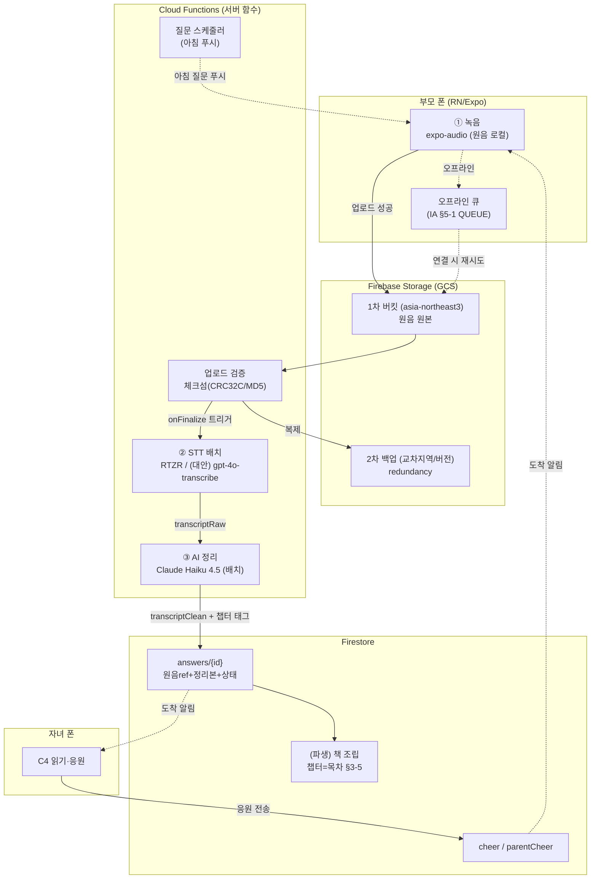
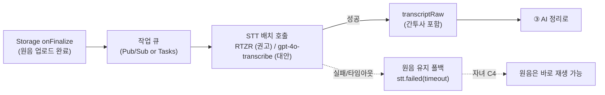
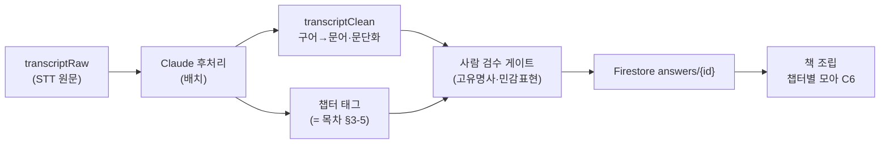

# BE 아키텍처 — 하루담 실서버 구현 컨셉 (local-first → Firebase)

> 소유: BE. 성격: **실구현 백엔드 컨셉**(설계·제안, 확정 아님). 지금 앱은 local-first로 돌고
> (`app/docs/BE_CONTRACT.md`), 이 문서는 **거기서 실서버로 넘어가는 아키텍처**를 그린다.
> 근거: `SPIKE_MVP_TECH.md`(STT §A·응답경로 §B·스택 §C) · `PRD.md §3-3·§3-5`(책 파이프라인)·
> `IA.md §5`(상태 축) · `BUSINESS_CASE.md §6`(원가). 팀 선례 스택: **RN/Expo + Firebase**.
> 숫자는 전부 `추정` 표기 — 확정은 G4 실측·계약 후. LLM 모델·단가는 `claude-api` 스킬
> 캐시(2026-06) 기준.

---

## 0. 이 문서가 답하는 것 (산출물 7)

> "음성 파일 이중 백업 저장 · 음성 기반 STT 전환 · AI를 통해 스토리로 정리하는 파이프라인 구축"

세 축(①②③)을 전체 데이터 플로우 위에 얹고, 멱등·실패 모드·보안·비용·이관 지점을 붙인다.
**local-first에서 이미 인터페이스(seam)를 그어뒀기 때문에, 실서버는 "새로 짓는 것"이 아니라
"구현체를 갈아끼우는 것"이다** — `app/src/services/` 한 지점(§6).

---

## 1. 전체 데이터 플로우

녹음 → 업로드 → 저장(이중 백업) → STT → AI 정리 → 챕터/책 조립 → 자녀 노출 → 응원.



**상태 전이(IA §5-1)와의 대응** — 화면이 이미 이 상태들을 그려두었다(§9-4):

```
recorded → uploading → organizing(밤사이) → done → done+cheer
  녹음됨     업로드중      STT+AI 정리중          정리완료   응원도착
              └ 실패 → QUEUE(오프라인 큐, 자동 재전송)
                       organizing 지연 → stt.failed(timeout) → 원음 폴백(C4)
```

local-first 지금은 `uploading`을 즉시 통과(디스크 쓰기)하고 `organizing`을 5초 데모 지연으로
흉내낸다. 실서버는 이 구간이 실제 업로드 + Cloud Function 배치가 된다 — **화면·상태 코드는
그대로**다.

---

## 2. ① 음성 파일 이중 백업 저장 — R7 원음 보존의 실구현

R7: **생전 본인 동의 없는 음성 합성 금지 · 원음 재생(책 QR)까지만.** 원음은 이 제품의 정서
자산이자 법적 민감물이라, "저장"이 아니라 "지켜야 하는 자산"으로 다룬다.

### 2-1. 이중화 설계

| 층 | 내용 | 근거 |
|---|---|---|
| **1차** | Firebase Storage(GCS) 리전 버킷 `asia-northeast3`(서울). 업로드 즉시 원본 | 팀 선례(스파이크 §C) · 저지연 |
| **2차** | (택1, 제안) ⓐ **GCS dual-region 버킷**(자동 지역 이중화, 운영 0) / ⓑ 스케줄 복제 함수로 **다른 리전 버킷**에 미러 / ⓒ **object versioning + lifecycle**로 세대 보존 | 지역 장애·실수 삭제 대비. 확정은 원가·RPO 목표 후 |
| **무결성** | 앱이 업로드 전 해시(CRC32C) 계산 → GCS 제공 체크섬과 대조. 불일치면 재업로드 | 조용한 파손 방지 |

권고 기본값: **ⓐ dual-region**(운영 부담 0) + object versioning(실수 삭제 복구). 트래픽이 커지면
ⓑ 교차 provider 미러를 후속 검토. `추정` — RPO(복구 시점 목표)를 PO와 정하고 확정.

### 2-2. 업로드 재시도 · 오프라인 큐 (IA §5-1 QUEUE)

- 녹음 종료 → 앱이 원음을 **로컬에 먼저 보관**(이미 local-first가 이 자리를 갖고 있다) →
  업로드 시도. 실패(오프라인)면 **QUEUE 상태**로 두고 연결 복구 시 자동 전송.
- 재시도: **지수 백오프**(예: 2·4·8·… 최대치) + 앱 재실행에도 큐 유지(온디바이스 영속).
- 사용자에게는 원인 코드와 함께 조용한 안내: `answer.upload_failed (offline)` — "폰에 담아뒀다가
  연결되면 보내드려요"(§9-4 C4·BE_CONTRACT 실패 모드 표). 팀 규칙 6.

### 2-3. 수명 · 삭제 정책

| 대상 | 정책 |
|---|---|
| 원음 | **보존이 기본** — 책 QR 재생까지가 쓰임(R7). 자동 만료 삭제 없음 |
| 삭제 | **부모(=저자) 또는 자녀 관리자의 명시 요청**으로만. 계정 삭제 시 원음·정리본 연쇄 삭제(개인정보 R4) |
| 익명 계정 | **30일 자동 삭제 옵션 반드시 OFF 확인** — 부모 계정이 사라지면 구독자 uid 소실 = 유령 구독자 사고(BE 하네스 채록 · IA §1-2 관찰) |
| 합성·복원 | **영구 금지**(R7·O4). 원음은 재생만, 어떤 파이프에도 TTS/음성복제 입력으로 넣지 않는다 |

### 2-4. 접근권 (부모 = 저자)

Storage 보안 규칙(제안):

| 주체 | 원음 read | 원음 write | 원음 delete |
|---|---|---|---|
| 부모(저자) | ○(가족) | ○(본인 답변) | ○(본인 요청) |
| 자녀(가족 구성원) | ○(QR·C4 재생) | ✕ | ✕ |
| 서버 함수(admin) | ○ | ○(정리 결과 write) | ○(정책 집행) |
| 그 외 | ✕ | ✕ | ✕ |

보안 규칙 변경 시 **거부 케이스를 실제로 확인**(permission-denied가 정당한지 — BE DoD).

---

## 3. ② 음성 기반 STT 전환 — 스파이크 §A 반영

**지연 허용치가 하루 단위**라 실시간이 아니라 **배치**다(스파이크 §A-1). 가장 싼 구간 + 가장
정확한(느린) 모델을 쓸 수 있는 것이 이 제품의 이점.

### 3-1. 파이프라인



- **트리거**: Storage `onFinalize` → 큐(Pub/Sub 또는 Cloud Tasks) → STT 배치. 큐를 두는 이유는
  재시도·속도 제한·비용 평탄화(밤사이 몰아 처리).
- **밤사이 배치**: 지금 local-first의 `nightly.ts`가 하는 일을 **스케줄 Cloud Function**이 한다
  (동일 상태 전이 organizing→done). "밤사이"는 UX상 다음날 아침 정리본 도착과 정합(§9-4 M5·P2).
- **실패 폴백**: STT 실패·지연이어도 **원음은 이미 저장됨** → 자녀 C4는 원음 재생 + "정리 중"
  으로 살아남는다(§9-4 C4 빈 상태). 원인 코드 `stt.failed (timeout)` 노출.

### 3-2. 후보·비용 (스파이크 §A-2·§A-6)

| 스택 | 평균 CER(범용) | 단가 | 1,000명 월 STT `추정` |
|---|---|---|---|
| **권고: 리턴제로 RTZR 배치** | 5.91%(벤치 1위) | ≈16.7원/분 | ≈60만 원 |
| 대안: gpt-4o-mini-transcribe | 한국어 `미확인` | ≈4.1원/분 | ≈15만 원 |
| 참고: 네이버 클로바 | 7.52% | ≈20원/분 | ≈72만 원 |

- **G4 선행 과제 명시**: 위 CER은 범용 벤치이고 **고령자·사투리 전용 공개 벤치가 없다**
  (스파이크 §A-3). 착수 전 **AI Hub 노인남여 샘플 30~50문장으로 RTZR vs gpt-4o-transcribe vs
  클로바 CER 실측(1~2일)** — 후처리 후 CER ~10% 이하면 음성 우선 확정, 품질 동급이면 1/4 가격인
  OpenAI로 간다. **이 파일럿 전에는 스택을 확정하지 않는다.**
- 폴백(실측 불합격 시): AI Hub 노인 데이터로 Whisper 계열 파인튜닝, 또는 국내 업체 커스텀 계약
  — 둘 다 MVP 이후 과제. 대량 계약 단가 문의는 **대외 접촉(PO 승인)**.

---

## 4. ③ AI를 통해 스토리로 정리하는 파이프라인

구어(간투사·반복·사투리 억양) → **읽을 만한 문어 문단**. 스파이크 §A-5: "출력물은 자막이 아니라
읽을 만한 문단"이라 여기 품질이 체감을 결정한다. LLM 후처리는 **오류 교정 + 간투사 제거 +
문단화 + 챕터 태깅**을 한 배치 호출로 겸한다.

### 4-1. 처리 단계



- **구어→문어 정리 원칙**: 간투사("어…", "그…")·반복 제거, 문단화, 명백한 오인식 교정. **단
  사투리 톤·화자의 말맛은 보존한다**(자서전의 정서 자산). 원문에 없는 **고유명사(지명·인명)는
  복원 못 한다**(스파이크 §A-5 한계) → 자녀/부모의 가벼운 이름 교정 UI가 보완재(IA 관찰 O-2).
- **챕터 태깅 = 목차**(§3-5): 답변을 7챕터 슬롯 중 하나에 태깅. 지금 local-first는 질문의
  `chapterId`로 결정론적으로 태깅한다 — 서버도 **질문의 챕터를 1차 소스**로 쓰고, LLM은 애매한
  경우(자유 발화가 다른 챕터로 새는 경우)만 제안하게 한다. "빠진 장"을 만들지 않는 규칙(분기·
  민감 스위치)은 이미 `branching.ts`에 있다.
- **사람 검수 게이트**(§3-5 완성 단계): 고유명사·민감 표현은 **책 조립 전 사람이 최종 검수**.
  MVP~초기 물량 전제. 검수 주체·단가는 정식 V1 전 산정.

### 4-2. 모델 선택 · 비용 (`claude-api` 스킬 캐시 2026-06)

배치·비대화·대량이라 **비용 최적 구간**이다. 후처리는 난도가 낮은(정규화) 작업이므로:

| 용도 | 모델 | 단가(입력/출력 per 1M) | 건당 `추정` | 근거 |
|---|---|---|---|---|
| **기본(권고)** | **Claude Haiku 4.5** (`claude-haiku-4-5`) | $1 / $5 | ≈3.7원 (Batch 50% → ≈1.9원) | 스파이크 §A-5 "하이쿠급 건당 ~4원"과 정합 |
| 품질 스텝업 | Claude Sonnet 5 (`claude-sonnet-5`) | $2 / $10 | ≈7.5원 (Batch → ≈3.7원) | 사투리 심한 표본에서 후처리 품질이 부족하면 |

- 산정: 답변 1건 입력 ~700토큰 + 출력 ~400토큰 `추정`(2분 발화). 1,000명·월 18,000건 →
  Haiku ≈ **6.7만 원/월**(Batch 배치면 ≈3.4만 원). 스파이크 §A-6 "~7만 원"과 일치.
- **왜 Opus가 아니라 Haiku인가**: 이 작업은 창의가 아니라 **정규화**다. `claude-api` 스킬의
  비용 원칙(품질이 유지되는 가장 싼 구간을 실측으로 고른다)에 따라, 대량·저난도·배치에는 Haiku가
  맞다. 품질은 **G4 실측 파일럿의 후처리 결과로 판정**하고, 부족하면 Sonnet 5로 스텝업한다.
- **Batch API**(비지연 50% 할인)가 "밤사이" 배치와 정확히 맞는다 — 지연 허용치가 하루 단위라
  실시간 요금을 낼 이유가 없다.
- 프롬프트 설계 메모: system에 "간투사·반복 제거, 사투리 톤 보존, 없는 고유명사 지어내지 말 것,
  민감 주제(민감 스위치 off된 것)는 정리 대상에서 제외" 규칙을 고정 → **prompt caching**으로
  프리픽스 재사용(단가↓). 출력은 structured output(문단 배열 + 제안 챕터)로 받는다.

---

## 5. 멱등 · 실패 모드 · 보안 · 비용

### 5-1. 멱등 (local-first에서 이미 지킨 것을 서버로)

`app/docs/BE_CONTRACT.md §4`의 멱등 규칙이 서버에서도 계약이다:

- **STT/AI 파이프는 멱등** — 같은 원음 파일 재처리·중복 트리거에 답변이 두 번 생기지 않는다.
  `putAnswer`는 `set(merge)`(answerId 키). Storage 재트리거(GCS at-least-once)를 전제로 설계.
- **밤사이 배치는 `done`이면 no-op** — 스케줄 중복 실행·수동 재처리 흡수.
- **웹훅/트리거는 순서를 보장하지 않는다** → 상태 전이는 **이벤트 시각 가드**
  (`writeAnswerIfNewer` 상당, `stateUpdatedAt` 역전 방지). 응원은 newest-wins.
- **Firestore 문서 ID 내림차순 orderBy 금지**(오름차순 후 코드에서 뒤집기), **맵 키의 점은
  밑줄 치환** — BE 하네스 채록.

### 5-2. 실패 모드 (요약 — 전체 표는 BE_CONTRACT §5)

| 순간 | 실패 | 클라이언트가 받는 것 |
|---|---|---|
| 원음 업로드 | 오프라인 | `answer.upload_failed (offline)` → 큐·자동 재전송 |
| STT/AI 정리 | 지연·타임아웃 | `stt.failed (timeout)` → 원음 폴백(C4 재생 유지) |
| 정리본 로드 | 서버 오류 | `story.fetch_failed` → 재시도 |
| 응원 전송 | 오프라인 | `cheer.send_failed (offline)` → 로컬 큐 후 전송 |

원인 코드를 사용자 배너·로그에 붙인다(팀 규칙 6). 로그는 구조화(`{"type":...,"outcome":...}`) —
실거래 하나를 로그 한 줄로 검증(BE DoD). 지금 local-first `services/log.ts`가 그 자리다.

### 5-3. 보안 · 개인정보 (R4 인생기록 · R7 음성권)

- **민감 인생기록(R4)**: 원음·정리본은 가족 그래프 안에서만 접근(Firestore/Storage 보안 규칙 —
  §2-4). 서버 함수만 정리 결과 write. 베타 동의서에 민감정보·열람 범위 반영(정식 V1 전 법무).
- **음성권(R7)**: 합성·복원 영구 금지(§2-3). 원음은 어떤 파이프에도 TTS 입력으로 넣지 않는다.
- **부모 익명 인증 + 콘솔 스위치는 세트**: 익명 로그인 활성화 + **30일 자동 삭제 OFF** 확인.
  인증 코드와 콘솔 설정이 어긋나면 앱엔 모호한 오류만 뜬다(`ADMIN_ONLY_OPERATION` 꼴).
- 보안 규칙 변경 시 **거부 케이스 실제 확인**(permission-denied가 정당한지).

### 5-4. 비용 총괄 (`추정`, 1,000명 활성 가정 — 보수적)

| 항목 | 월 `추정` | 출처 |
|---|---|---|
| STT (RTZR 권고) | ≈60만 원 (대안 OpenAI ≈15만) | 스파이크 §A-6 |
| AI 정리 (Haiku, Batch) | ≈3.4만~6.7만 원 | §4-2 |
| Storage(원음 이중화)·Firestore·Functions | 소액~수만 원 | 규모 의존 |
| 매일 알림 | **0원**(푸시) | 스파이크 §B-4 |
| **합계(권고 스택)** | **≈67만 원** | 매출 대비 ~6%, 공헌이익 65% 유지(BUSINESS_CASE §6-A) |

---

## 6. local ↔ 실서버 이관 지점

**seam은 이미 그어져 있다.** 코드에서 바꾸는 것은 두 곳뿐:

| 이관 대상 | local-first (지금) | 실서버 | 파일 |
|---|---|---|---|
| 저장소 | `LocalRepository`(AsyncStorage) | `FirestoreRepository`(스텁→배선) | `app/src/services/index.ts` **한 줄** |
| STT | `pipeline/stt.ts` 모의(질문별 정리본) | RTZR/OpenAI 배치 호출 | `app/src/services/pipeline/stt.ts` |
| 밤사이 정리 | `pipeline/nightly.ts` + 5초 타이머 | 스케줄 Cloud Function | 서버측(같은 상태 전이) |
| AI 정리 | (모의: 정리본 = 시드) | Claude Haiku 배치(§4) | 서버 STT 파이프에 합류 |
| 책 조립 | `pipeline/book.ts`(챕터별 조립) | **동일 로직 서버 이식** | 그대로 |

- 화면·스토어는 `DiaryRepository` 인터페이스(`app/src/services/repository.ts`)에만 의존하므로
  **UI는 이관에 영향받지 않는다.** `FirestoreRepository` 스텁 헤더에 이관 시 지킬 규칙(멱등·
  순서 가드·orderBy·익명 인증)을 이미 박아뒀다.
- 상세 개체·메서드·실패 모드·멱등 계약은 **`app/docs/BE_CONTRACT.md`**가 단일 기준.

### 이관 순서 (제안)

1. **G4 실측 파일럿**(선행 게이트, 1~2일) — STT 스택 확정.
2. Firebase 프로비저닝(프로젝트·키·보안 규칙·익명 인증 스위치) — **PO 영역**(에스컬레이션).
3. `FirestoreRepository` 배선 + `services/index.ts` 교체 → 저장소만 서버로.
4. Storage `onFinalize` → 큐 → STT 배치 → AI 정리 Cloud Function(멱등·순서 가드).
5. 이중 백업(dual-region/versioning) + 삭제 정책 + 보안 규칙 거부 케이스 검증.
6. admin 콘솔은 초기엔 Firestore 콘솔 직접 조작 + 최소 운영 스크립트(스파이크 §C).

> **BE 권한 경계**: 구현·배포 준비까지. 실 Firebase 프로젝트·키·콘솔·과금·프로덕션 배포는
> **PO 승인/영역**. 데이터 삭제·마이그레이션은 PO 승인 필수.
