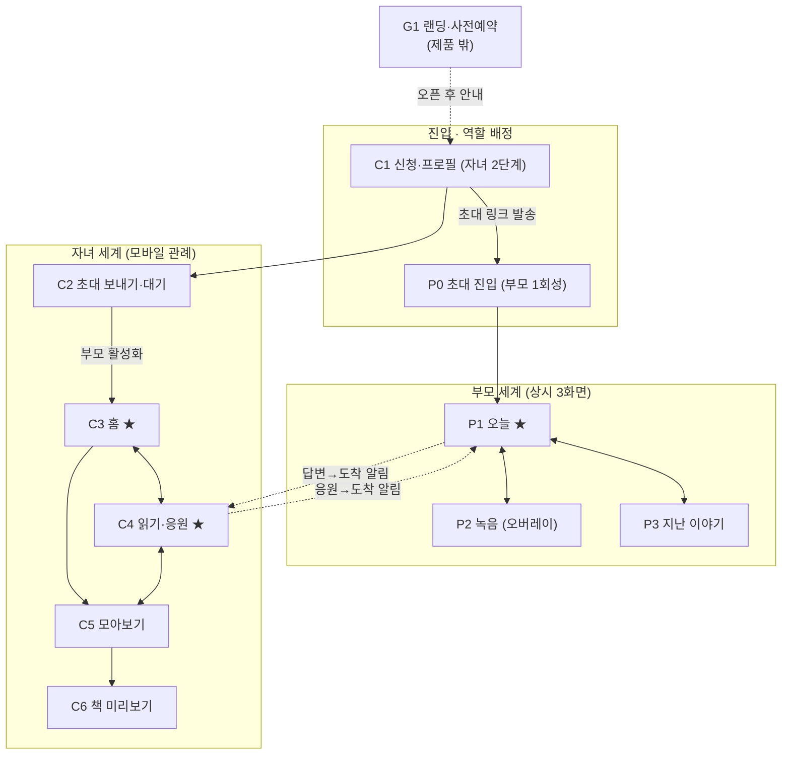
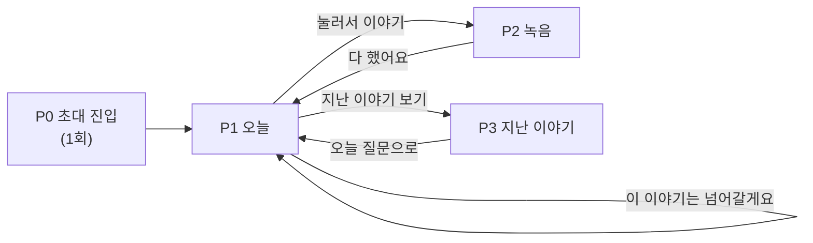
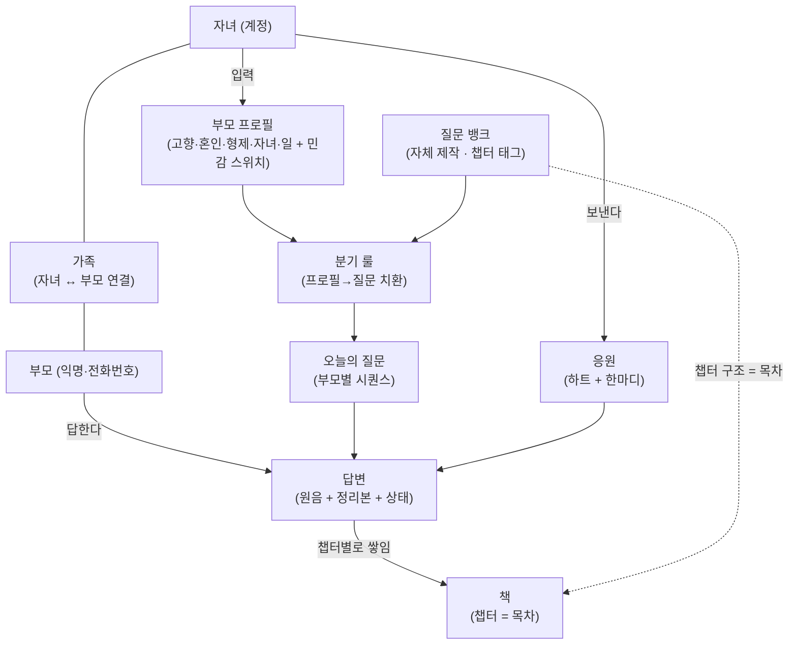
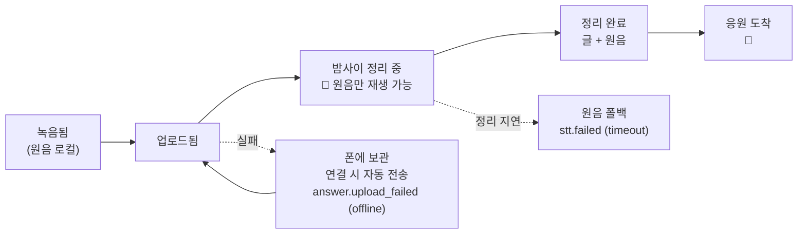
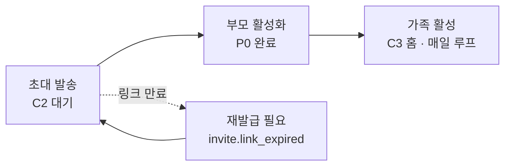
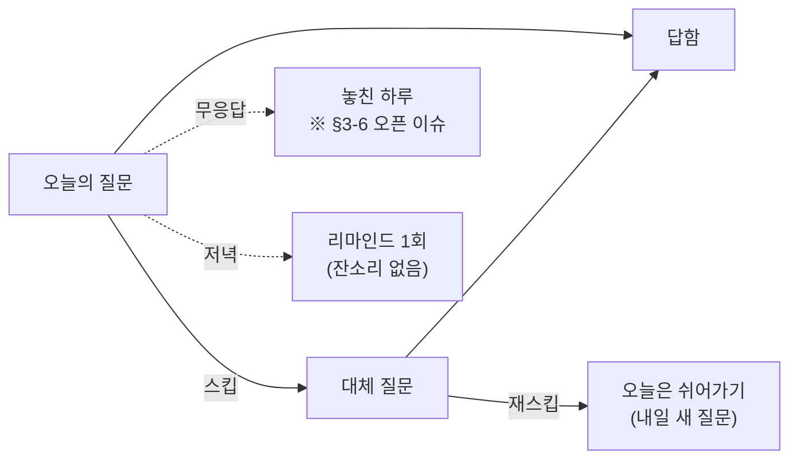

# IA — 하루담(가칭) 정보 구조

> 작성: PD · 2026-08-28 · 제품명 **하루담**(가칭, DECISIONS #6)
>
> **이 문서는 파생이다.** 화면·상태·카피의 **원본은 `PRD.md §9`**(PD 작성 화면 명세)이고,
> 기능 범위의 원본은 `PRD.md §3`(PM)이다. IA는 그것을 **구조로 다시 그린 지도**일 뿐이다 —
> 어긋나면 **§9가 이긴다.** 화면 코드(P0~P3·C1~C6·B0~B4)는 §9의 것을 그대로 쓴다
> (새 코드를 만들지 않는다). 구조화 중 발견한 구멍은 발명하지 않고 **"IA 관찰"**로만 남긴다.
>
> 근거 문서: `PRD.md §9`(화면)·§3-1(기능 I1~I9)·§3-2(응답 경로 B안)·§3-5(책 파이프라인)·
> §3-6(놓친 하루 오픈 이슈)·§3-4(뺄 것 O1~O10) · `DESIGN_CONCEPT.md`(화면 8종) ·
> `prototype/index.html`(구현 흐름).

---

## 1. 최상위 구조 — 하나의 앱, 두 개의 세계

하루담은 **단일 앱(RN/Expo)이며, 최상위 축은 역할 분기(부모 / 자녀)다**(§3-2 B안 —
단일 앱·역할 분기). 두 역할은 같은 코드베이스지만 **다른 사람·다른 기기·다른 목적**을
쓴다 — 정보 구조도 두 트리로 갈라진다. 둘을 잇는 것은 **가족(초대 링크로 맺어진
자녀↔부모 연결)** 하나다.

```
하루담 (단일 앱)
├── 공용 표면 (역할 배정 전) ── G1 랜딩 · 초대 진입 · 온보딩
├── 부모 세계 ─────────────── "매일 한 이야기를 담는다" (P0~P3)
└── 자녀 세계 ─────────────── "묻고, 읽고, 응원하고, 책으로 본다" (C1~C6)
```

### 1-1. 진입점과 역할 배정

| 진입점 | 누가 | 어디로 | 근거 |
|---|---|---|---|
| **G1 랜딩 → 사전예약** | 미래의 자녀(구매자) | 앱 아님 — 연락처 수집만(제품 없음) | §5-1·§9-2 |
| **자녀 스스로 신청** | 자녀 | C1(신청·프로필) → 자녀 세계 | I1·§9-4 C1 |
| **자녀 초대 링크 → 부모** | 부모 | P0(초대 진입) → 부모 세계 | I1·R3·§9-4 P0 |

**역할은 스스로 고르지 않는다.** 자녀는 신청 흐름으로 들어와 자녀가 되고, 부모는
자녀가 보낸 링크로만 들어와 부모가 된다. "부모/자녀 중 무엇으로 시작할까요" 같은
선택 화면은 없다 — 진입 경로가 곧 역할이다.

### 1-2. 인증 모델 — 두 역할이 비대칭이다

| | 부모 | 자녀 |
|---|---|---|
| 계정 | **없음** — 회원가입·비밀번호 없음 | 있음(계정) |
| 신원 | 초대 코드 바인딩(익명 인증 + 전화번호) | 자녀가 만든 계정 |
| 진입 | 초대 링크 원터치 = 로그인(§3-2·§9-1 D2) | 신청 흐름 |
| 설계 이유 | R3(시니어 온보딩 장벽) — 자녀가 대리 설정, 부모는 "누르기만" | 구매자·관리 주체 |

> **IA 관찰(경계):** 부모 계정이 "전화번호 기반 익명 인증"이라 **기기 교체·재설치 시
> 복구 경로**가 IA 상 비어 있다. 스파이크 §C가 "익명 계정 30일 자동 삭제 옵션 확인 —
> 부모 계정이 사라지면 사고"를 경고했다. 이는 화면 명세가 아니라 인증·데이터 수명
> 문제 → **BE/PM 몫**(IA는 자리만 표시).

---

## 2. 화면 계층도 (sitemap)

화면 코드는 `PRD.md §9`와 1:1이다. 부모 상시 화면은 **3개**(P1·P2·P3), P0은 1회성
진입이다(§9-3). 자녀는 6개(C1~C6). 책 미리보기 내부 블록 B0~B4는 C6의 구성 요소다.

### 2-1. 텍스트 트리

```
공용 (역할 배정 전)
├── G1  랜딩·사전예약               [제품 밖 — 연락처만]
├── P0  초대 진입 (부모, 1회성)      → 부모 세계로
└── C1  신청·프로필 (자녀, 2단계)    → 자녀 세계로
    ├── C1a  관계 (필수: 호칭·부모 성함·내 이름)
    └── C1b  프로필 (선택 5문항 + 민감 주제 스위치 "여쭙지 않을 이야기")

부모 세계  (탭바 없음 · 상시 3화면)
├── P1  오늘  ★홈·가장 반복
│    ├── (상태) 응원 도착 배너 → 펼침
│    ├── (상태) 답변 완료 → "밤사이 정리" 카드
│    ├── (상태) 다음날 → 정리본 도착 + 오늘 질문
│    └── (행동) 스킵 "이 이야기는 넘어갈게요" → 대체 질문 / 재스킵 시 휴식
├── P2  녹음 (전체화면 오버레이)     ← P1에서만 진입
│    └── (종료) "밤사이 글로 정리해 드릴게요" + 원음 즉시 재생
└── P3  지난 이야기                 ← P1 보조 링크

자녀 세계  (일반 모바일 관례)
├── C2  초대 보내기·대기            ← C1 직후 (부모 활성화 전 자녀의 대기 화면)
├── C3  홈  ★                      ← 부모 활성화 후 기본 화면
│    ├── 오늘 카드(질문 + 부모 답변 상태)
│    ├── 이번 주 응답 현황 "3/7" (I6)
│    └── 최근 이야기 미리보기 → C4
├── C4  이야기 읽기·응원  ★가장 반복  ← C3 / C5 / 알림
│    ├── (상태) 밤사이 대기 = 원음만 + "정리 중"
│    └── (상태) 정리 완료 = 글 + 원음 + 응원 보내기
├── C5  모아보기 (진행감 "23/365")   ← C3 하단 내비
│    ├── 진행 카드 → [책으로 미리보기] → C6
│    └── (부속 시트) 질문 설정 = 민감 주제 스위치 사후 변경
└── C6  책 미리보기                 ← C5 진행 카드
     ├── B0  샘플 라벨
     ├── B1  표지 (부모 이름·자녀 이름 슬롯)
     ├── B2  목차 (= 챕터 구조, §3-5)
     ├── B3  본문 펼침면 (정리본 + 날짜 + QR 원음 마크)
     └── B4  진행 꼬리 "지금까지 N개의 이야기가 담겼어요"
```

### 2-2. mermaid — 공용·역할 분기



### 2-3. mermaid — 부모 세계(단순함이 곧 설계)



부모 트리에 **분기가 거의 없다** — 이것이 접근성 설계 그 자체다(§9-5: 화면당 주
행동 1개, 탭바·햄버거·숨은 제스처 없음). "상시 3화면"은 미학이 아니라 IA 제약이다.

---

## 3. 내비게이션 모델 — 두 역할, 두 규칙

### 3-1. 부모 — "보이는 버튼이 전부"

- **탭바·햄버거·스와이프 없음.** 이동은 화면에 **노출된 버튼**으로만(§9-3·§9-5).
- 상시 화면 3개 사이만 오간다. P2는 P1에서만 열리는 오버레이라 트리에서 P1에 종속.
- 뒤로 가기는 명시 버튼("← 오늘 질문으로")으로만 — OS 뒤로 제스처에 기대지 않는다.
- 알림·응원·정리본은 **새 화면이 아니라 P1의 상태**로 들어온다 → 부모는 "화면을
  찾아다니지" 않는다.

### 3-2. 자녀 — 일반 모바일 관례

- C3(홈) 기준의 얕은 스택 + C3↔C5 하단 내비 2개(홈·모아보기, 프로토타입 `.c-nav`).
- C4·C6은 푸시-팝 스택(뒤로 가기 상시). 알림 탭 → C4 딥링크.
- 민감 주제 사후 변경은 **C5의 부속 시트**로 흡수 — 새 최상위 화면을 만들지 않는다.

### 3-3. 화면 전이표 (무엇에서 무엇으로 · 트리거)

| From | To | 트리거 | 방향 | 근거 |
|---|---|---|---|---|
| G1 | (앱 밖) | 사전예약 제출 | — | §9-2 |
| C1a | C1b | "다음 — 질문 맞추기" | 자녀 | §9-4 C1 |
| C1b | C2 | "초대장 만들기" / "나중에 채울게요" | 자녀 | §9-4 C1 |
| C2 | C3 | **부모 활성화**(P0 완료 이벤트) | 시스템 | §9-4 C2·C3 |
| C3 | C4 | 최근 이야기 탭 / 답변 도착 알림 | 자녀 | §9-4 C3·C4 |
| C3 | C5 | 하단 내비 "모아보기" | 자녀 | §9-4 C5 |
| C4 | (P1) | 응원 전송 → 부모 알림 | 시스템 | I4·§9-4 P1 |
| C5 | C6 | "책으로 미리보기" | 자녀 | §9-4 C6 |
| C6 | C5 | "← 모아보기로" | 자녀 | §9-4 C6 |
| P0 | P1 | "시작하기" | 부모 | §9-4 P0 |
| P1 | P2 | "눌러서 이야기해 주세요" | 부모 | §9-4 P1 |
| P2 | P1 | "다 했어요" → "오늘은 여기까지" | 부모 | §9-4 P2 |
| P1 | P1 | 스킵 → 대체 질문(같은 화면 치환) | 부모 | I8·§9-4 P1 |
| P1 | P3 | "지난 이야기 보기" | 부모 | §9-4 P3 |
| P3 | P1 | "← 오늘 질문으로" | 부모 | §9-4 P3 |
| P1 | (C4) | 답변 전송 → 자녀 알림 | 시스템 | I4 |

**시스템 전이(굵게 표시된 트리거)** — 자녀·부모의 손이 아니라 상대의 행동으로
발생하는 이동이 이 제품의 심장이다(피드백 루프 I4). IA 상 두 트리를 잇는 유일한
연결선이 전부 여기 있다.

---

## 4. 콘텐츠·데이터 개체 지도 (IA 관점 — DB 스키마 아님)

> 상세 스키마·인덱스·관계 카디널리티는 **BE 몫**이다. 여기서는 "어떤 개체가 있고,
> 어느 화면이 그것을 노출하는가"까지만 그린다.



| 개체 | IA 관점의 정의 | 어느 화면이 노출하나 |
|---|---|---|
| **가족** | 자녀 1 ↔ 부모 1의 연결(MVP는 1:1 — 다인 참여 O8 제외). 초대 코드가 맺는다 | C2(대기)·C3(부모 이름)·P0(자녀 이름) |
| **부모 프로필** | 자녀가 C1b에서 입력 · 민감 주제 스위치 포함. **분기 룰의 입력값** | C1b · C5 부속 시트(사후 변경) |
| **질문 뱅크** | 자체 제작 질문 + **챕터 태그**(R6). 시간순이 아니라 챕터 슬롯 구조 | 부모에겐 "오늘의 질문"으로만, 전체는 비노출 |
| **분기 룰** | 프로필 조건 → 질문 치환/챕터 대체(I2, AI 아님). 내부 개체 — 화면에 직접 안 뜸 | C1b의 치환 미리보기로만 간접 노출 |
| **오늘의 질문** | 부모별 시퀀스에서 그날 배달된 1건. 스킵(I8) 신호도 여기 걸림 | P1(주인공) · C3(오늘 카드) |
| **답변** | **원음 + 정리본 + 상태**의 묶음(§3-5). 상태 축은 §5. 원음 보존은 R7 | P3·C4(전문) · C5·C6(요약·펼침면) · P1(완료 카드) |
| **응원** | 하트 + 한마디. **자녀가 쓴 그대로**(시스템이 다듬지 않음 — §9-7 화자 분리) | C4(작성) · P1(수신 배너) |
| **책** | 답변이 **챕터별로** 쌓인 것. 챕터 = 목차(§3-5). MVP는 디지털 미리보기까지 | C6(표지·목차·펼침면) · C5(진행감) |

**핵심 비대칭 3가지 (IA가 드러내는 것):**
1. **질문 뱅크 전체는 아무 화면에도 안 뜬다** — 부모는 "오늘 1건"만, 자녀는 답변된
   것만 본다. 뱅크는 시스템 개체다.
2. **분기 룰은 개체지만 표면이 거의 없다** — C1b 치환 미리보기 1곳이 유일한 창.
   "질문이 왜 이거지?"를 사용자가 역추적할 화면은 없다(의도된 것 — 조용한 개인화).
3. **책의 목차 = 질문 뱅크의 챕터 구조** — 별도 "목차 개체"를 만들지 않는다(§3-5:
   "챕터 구조가 곧 목차"). C6 B2는 뱅크 챕터의 뷰일 뿐이다.

---

## 5. 상태·전이 요약 (IA에 드러나는 상태 축)

### 5-1. 답변 1건의 생애 (§9-4 C4·P1·P2·§3-5와 일치)



| 상태 | 부모가 보는 것(P1·P3) | 자녀가 보는 것(C3·C4·C5) |
|---|---|---|
| 녹음됨/업로드 | "잘 들었어요 / 방금 말씀 듣기" | — |
| 밤사이 정리 중 | "밤사이 글로 정리해 드릴게요" | 🌙 원음만 + "정리 중"(C4 빈 상태) |
| 정리 완료 | 다음날 정리본 카드 | 글 + 원음 + 응원 보내기 |
| 응원 도착 | P1 상단 응원 배너 | (자녀가 보낸 것) |

이 상태 축은 **STT 배치(밤사이)** 전제의 IA적 결과다(§9-0). "정리 중"은 오류가
아니라 정식 상태이고, 그래서 두 역할 화면 모두에 자리를 갖는다.

### 5-2. 가족 활성화 상태 (§9-4 C2·P0과 일치)



- **미개봉(SENT)** 구간이 이 제품의 최대 마찰(§9-1 D2, R3) — C2의 본체가 "대기
  화면"인 이유. 부모가 링크를 열 때까지 자녀 세계는 C3로 못 넘어간다.
- 만료(EXPIRED)의 해결은 **자녀 쪽 재발급**으로 되돌린다(부모에게 문제를 안 시킴, P0 오류 규칙).

### 5-3. 질문 하루의 상태 (§9-4 P1 스킵 규칙과 일치)



---

## 6. 미결·경계 — IA에서 자리가 비어 있는 곳

### 6-1. MVP에 없는 것이 IA의 어디를 비워두나 (§3-4 O1~O10)

| 빠진 것 | IA 상 빈 자리 | 복귀 시 어디에 붙나 |
|---|---|---|
| O1 결제·구독 | **C1~C2 사이 결제 화면 없음** · C6에 주문 버튼 없음 | C1 신청과 C2 초대 사이 / C6 하단 |
| O2 리워드·포인트 | 부모 P1에 적립·포인트 표면 전무(의도 — 앱테크 아님) | V1.5 P1 부속 |
| O3 인쇄 제본 | C6는 **디지털 미리보기까지** — "실물 주문" 없음 | C6 B4 이후 |
| O7 AI 개인화 | 분기 룰은 있으나 **꼬리 질문·자유 생성 없음** | 오늘의 질문 생성부(비노출) |
| O8 다인 참여 | 가족 = 1:1. **형제 여럿 초대 화면 없음** | C2 초대 관리 |
| O9 카카오 선물하기 | 진입점에 커머스 채널 없음(G1 랜딩만) | 공용 진입 |
| O10 안부 확인 | 부모 세계에 생존 알림·안부 표면 없음 | (재검토 없음이 기본) |
| 알림톡(§3-3) | 리마인드는 **푸시만** — 알림톡 채널 없음 | V1.5 이탈군 재호출 |

### 6-2. "놓친 하루"(§3-6)가 IA 상 어디에 걸리나 — **오픈 이슈, 결정 아님**

미응답 날의 처리는 §3-6에서 **안 A~C가 정리만 됐고 미결(D8)**이다. IA 관점에서
현재 상태:

- **현재 기본값 = 안 A(빈 날은 빈 채로).** 아무것도 추가로 만들지 않으면 A다 —
  즉 **IA 상 "놓친 하루"는 어디에도 표면이 없다.** 챕터 슬롯이 안 채워질 뿐,
  "밀림"이 표시되는 화면·개체가 없다. 자녀에게는 "이번 주 3/7"(I6)의 숫자로만 흔적이 남는다.
- **안 B(밀린 질문함)를 택하면** → 부모 세계에 **새 표면**(보관함)이 생긴다. 상시
  3화면 제약(§9-5)과 충돌하므로 IA 재설계 대상.
- **안 C(자녀가 대신 채움)를 택하면** → 자녀 세계에 작성 흐름 + **책 개체에 "자녀가
  쓴 문단" 타입**이 추가된다. "부모의 언어로 남긴 인생" 명제와의 관계 정리 필요.

> **IA 관찰:** "놓친 하루"는 화면 결정 이전에 **개체 결정**이다 — B는 새 화면, C는
> 새 답변 타입을 낳는다. 그래서 이건 PD가 IA에서 정할 수 없다. §7 D8(정식 V1 전
> 결정)로 이미 등록됨 → **PM/PO 몫.** 결정 전까지 IA는 안 A(빈 자리)로 그린다.

### 6-3. 그 밖의 IA 관찰(구조화 중 보인 구멍 — 발명하지 않고 넘김)

| # | 관찰 | 넘길 곳 |
|---|---|---|
| O-1 | 부모 계정 복구 경로 부재(기기 교체·재설치) — §1-2 | BE/PM |
| O-2 | 이름 교정 UI(§3-5: LLM이 고유명사 복원 못 함)의 화면 위치 미정 — C4 또는 P3 안에 붙을 자리가 §9에 아직 없음 | PD 후속(범위는 PM) |
| O-3 | 자녀 계정 자체의 온보딩·설정(알림 관리·가족 재초대 외 계정 설정)이 §9에 최소만 있음 | PM(범위) → PD |
| O-4 | "질문 설정"(민감 주제 사후 변경)을 C5 부속 시트로 뒀으나, 자녀 계정 설정이 커지면 별도 설정 화면이 필요해질 수 있음 | PD 후속 |

---

## 부록 — 화면 코드 대조표 (§9와의 정합 확인)

| 코드 | 이름 | 역할 | §9 위치 | 프로토타입 id |
|---|---|---|---|---|
| G1 | 랜딩·사전예약 | 공용 | §9-2 | `part-landing` |
| P0 | 초대 진입 | 부모 | §9-4 P0 | `p-invite` |
| P1 | 오늘(홈) | 부모 | §9-4 P1 | `p-today` |
| P2 | 녹음 오버레이 | 부모 | §9-4 P2 | `p-record` |
| P3 | 지난 이야기 | 부모 | §9-4 P3 | `p-archive` |
| C1 | 신청·프로필(2단계) | 자녀 | §9-4 C1 | `c-start`·`c-profile` |
| C2 | 초대 보내기·대기 | 자녀 | §9-4 C2 | `c-invite` |
| C3 | 홈 | 자녀 | §9-4 C3 | `c-home` |
| C4 | 이야기 읽기·응원 | 자녀 | §9-4 C4 | `c-story` |
| C5 | 모아보기 | 자녀 | §9-4 C5 | `c-archive` |
| C6 | 책 미리보기(B0~B4) | 자녀 | §9-4 C6 | `c-book` |

*이 표가 어긋나면 IA가 아니라 §9를 기준으로 삼는다 — IA는 파생이다.*
