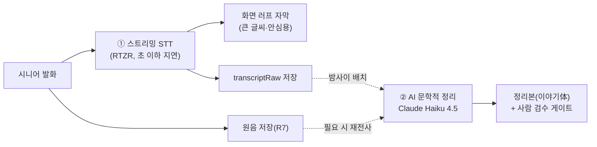

# SPIKE_REALTIME_STT_WEB — 실시간 STT · 웹앱(PWA)+알림톡 기술 스파이크

- 작성: BE · 2026-08-29 · **데스크 리서치 + 웹 검색** (코드·실측 없음)
- 성격: **개발 전 평가 스파이크(구현 아님).** PO 아이디어 2건을 사실로 규명해 **BD**(플랫폼·BM)와
  **PM**(기능) 입력값으로 넘긴다. 최종 BM·범위 판단은 BD/PM/PO.
- 딛고 선 문서: `SPIKE_MVP_TECH.md`(STT §A·응답경로 §B·스택 §C)를 **갱신·확장**한다. 특히 §B는
  "카카오 **챗봇** 음성 수신 No-go"였고, 이 문서는 다른 질문 —— **자체 웹앱이 스스로 녹음, 알림톡은
  알림+딥링크 채널로만** —— 을 새로 규명한다.
- 표기: 숫자엔 출처 링크 또는 `추정`, 못 연 것 `미확인`. **환율 1 USD ≈ 1,380원 `추정`**.
  카카오·네이버클라우드(ncloud)·리턴제로 dev 포털은 **사내 프록시 차단 가능성** — 차단 시 검색
  스니펫 기반이며 계약 전 원문 재확인 필요. **정책·가격 기준일: 2026-08-29.**

---

## 판정 요약

| 축 | 판정 | 한 줄 |
|---|---|---|
| **A. 실시간(스트리밍) STT** | **보완 가능 — 조건부 Go(제안)** | 실시간 러프 자막 ①과 밤사이 문학적 정리 ②는 **충돌이 아니라 보완**이다. **단** ① 자막은 "받아쓰기가 되고 있다"는 **안심용**이지 시니어에게 **편집을 시키는 도구가 아니어야** 성립. **RTZR 스트리밍 단가 = 배치 단가**라 2단계가 원가 중립(OpenAI realtime은 배치의 ~4배라 provider 선택이 갈림). 시니어 발화·사투리 CER은 여전히 G4 실측 선행. |
| **B. 웹앱(PWA)+알림톡** | **부분 성립 — 제약이 크다(제안)** | **결정타: iOS 카카오톡 인앱 브라우저에서 `getUserMedia(audio)`가 깨진다(iOS 15.1+ 문서화된 플랫폼 한계).** → 웹 녹음은 **외부 브라우저 강제 오픈**이 전제. iOS 웹푸시는 **홈 화면 추가 필수**(시니어 장벽). 알림톡 daily 발송은 **월 ~24만 원/1,000명 + 템플릿 심사(매일 반복 `미확인`)**. web의 이점(스토어 설치 없음)을 이 제약들이 상당 부분 상쇄 → 습관 코어(매일 푸시)는 네이티브가 여전히 저마찰. |

---

## A. 실시간(스트리밍) STT — "말하면 화면에 바로 찍힘"

### A-1. 무엇을 규명하나 — 현재 설계와의 공존 질문

현재 설계(§9-4·`SPIKE_MVP_TECH §A`)는 **"로컬은 녹음만, 정리는 밤사이 배치"**다. PO 아이디어는
**녹음 중 STT가 실시간으로 화면에 찍혀** 시니어가 보며 확인·수정하는 것이다. 질문: **둘이 충돌인가
보완인가?**

핵심 구분 — **두 산출물은 성격이 다르다:**

| | ① 실시간 러프 자막 | ② 밤사이 AI 정리(이야기体) |
|---|---|---|
| 목적 | "받아쓰기가 되고 있다"는 **안심** + 큰 오인식 즉시 인지 | 구어→문어·문단화·사투리 톤 보존, **읽을 만한 이야기** |
| 시점 | 말하는 동안(스트리밍) | 하루 단위 배치(지연 허용) |
| 품질 | 러프(간투사·오인식 그대로) | 정제(사람 검수 게이트, §3-5) |
| 편집 | **선택** — 강제하면 안 됨(아래 A-4) | 없음(자동) + 자녀 이름 교정 보완 |

→ **보완이다.** ①은 "지금 잘 담기고 있어요"의 실시간 신호(안심), ②는 자산이 되는 최종 정리.
②가 여전히 권위 있는 정리본이고, ①은 그 위에 얹는 안심 레이어다. **충돌 조건은 하나** — ①을
"시니어가 오탈자를 고치는 편집 화면"으로 만들면 음성 우선(P2, 타이핑 장벽 제거)의 전제가 깨진다.

### A-2. 스트리밍 STT 후보 — 지연·정확도·**스트리밍 vs 배치 단가**

| 후보 | 스트리밍 지연 | 정확도(범용) | **스트리밍 단가** | 배치 단가(참고) | 비고 |
|---|---|---|---|---|---|
| **리턴제로 RTZR** | "짧은 지연"(초 이하 목표, AICC용) [dev docs](https://developers.rtzr.ai/docs/en/stt-streaming/) *(프록시 차단 — 스니펫)* | 한국어 벤치 1위 5.91%(`SPIKE_MVP_TECH §A`) | **시간당 1,000원 ≈ 16.7원/분** (2024-10-23 1,500→1,000원 인하, [notice](https://developers.rtzr.ai/docs/en/notice/2024/20241023/) 스니펫) | ≈16.7원/분(동일) | **스트리밍=배치 단가** → 2단계 원가 중립 |
| OpenAI realtime (gpt-realtime / live transcribe) | 라이브 델타 | 다국어(한국어 `미확인`) | **$0.017/분 ≈ 23.5원/분** ([costgoat](https://costgoat.com/pricing/openai-transcription)·[diyai](https://diyai.io/ai-tools/speech-to-text/openai-whisper-api-pricing-2026/)) | $0.006/분(gpt-4o-transcribe) ≈ 8.3원/분 | **realtime이 배치의 ~2.8배** — 실시간의 비용 프리미엄이 큼 |
| Deepgram Nova-3 스트리밍 | **sub-300ms** ([Deepgram](https://deepgram.com/learn/deepgram-vs-openai-vs-google-stt-accuracy-latency-price-compared)) | 클래스 최상위(영어 기준), **한국어 `미확인`** | **$0.0077/분 ≈ 10.6원/분** ([diyai](https://diyai.io/ai-tools/speech-to-text/deepgram-pricing-2026/)) | — | 한국어 품질 미검증이 리스크 |
| 네이버 클로바 스피치 | gRPC 실시간(2024 추가) [koreatechtoday](https://koreatechtoday.com/naver-cloud-introduces-real-time-streaming-for-clova-speech-live-broadcasts-with-ai-subtitling/) | 벤치 2위 7.52% | **`미확인`**([ncloud](https://www.ncloud.com/product/aiService/clovaSpeech) 프록시 차단) | ~20원/분(`SPIKE_MVP_TECH`) | 국내·화자분리 등 |
| Web Speech API(브라우저 내장) | 브라우저 처리 | "일관성 없음, SLA 없음"([AssemblyAI](https://www.assemblyai.com/blog/speech-recognition-javascript-web-speech-api)) | 무료 | — | **B-2에서 별도 판정 — R4·인앱 리스크로 부적합** |

**월 비용 영향 `추정`(1,000명, 36,000분/월 — `SPIKE_MVP_TECH §A-6` 가정 계승):**

| 스택 | 실시간 STT | 밤사이 AI 정리(Haiku 4.5, Batch) | 합계/월 | vs 현재 배치안(~67만) |
|---|---|---|---|---|
| **RTZR 스트리밍(단일 STT)** | 36,000분 × 16.7원 ≈ 60만 | ≈3.4만(`claude-api` 스킬 $1/$5, Batch 50%) | **≈63만** | **거의 동일 — 실시간 자막 사실상 무료** |
| OpenAI realtime | 36,000분 × 23.5원 ≈ 84.6만 | ≈3.4만 | ≈88만 | +21만(실시간 프리미엄) |
| Deepgram(한국어 미검증) | 36,000분 × 10.6원 ≈ 38만 | ≈3.4만 | ≈41만 | -26만(단 한국어 CER 미확인) |

핵심: **RTZR은 스트리밍이 배치와 같은 단가**라, 스트리밍 STT를 **단일 STT 소스**로 써서 (a)
실시간 화면 표시 + (b) 그 전사를 밤사이 AI 정리 입력으로 재사용하면 **배치 STT를 한 번 더 돌릴
필요가 없어** 원가가 늘지 않는다. OpenAI realtime은 배치의 ~2.8배라 provider 선택이 곧 BM 변수다.

### A-3. 2단계 파이프라인 제안 — 검토

- **STT 한 번, 두 산출.** ① 스트리밍 결과를 즉시 화면에 + 그대로 `transcriptRaw`로 저장 → ②는
  그 raw를 문학적으로 정리. 원음은 별도 보존(R7). **배치 STT 재실행은 선택**(품질 불만 시에만).
- **충돌 아님 근거**: ①은 지연 민감·러프, ②는 지연 허용·정제. 시점·품질·목적이 겹치지 않는다.
  ②의 권위(밤사이 정리본)는 그대로 유지되고, ①은 그 앞단의 안심 신호일 뿐.
- **원가 중립 조건**: 스트리밍 STT provider가 배치와 단가가 같아야 함(RTZR ✅). 아니면 실시간은
  순수 추가비용(OpenAI realtime +21만/월).

### A-4. 접근성 — 실시간 자막을 시니어가 읽고 고치는 UX 난이도

| 항목 | 사실/난이도 | 설계 함의 |
|---|---|---|
| 글자 크기 | §9-5 접근성 기준(큰 글씨) 그대로 적용 | 자막은 본문급 큰 활자 |
| 지연 허용 | RTZR/Deepgram sub-초 → 체감 즉시 | 문제 없음 |
| **interim(중간) 결과 깜빡임** | 스트리밍은 부분 결과가 **실시간으로 바뀐다**(단어가 교체됨) | 시니어에게 **혼란 요인** — 확정 전 텍스트는 연회색, 확정은 먹색으로 시각 분리 필요 |
| **편집(오탈자 수정) UX** | 텍스트 필드 편집은 기술은 쉬우나 **폰 타이핑은 시니어 장벽**(P2의 전제) | **강제 금지.** 편집은 선택(큰 오인식만), 무거운 교정은 자녀 이름 교정 UI(IA 관찰 O-2)로 이관 |

→ **판정 함의**: 실시간 자막은 **"보며 안심하는" 표면**으로 설계해야 한다. "보며 고치는" 편집
도구로 만들면 음성 우선 원칙과 충돌한다. 이 경계가 A 성립의 핵심 조건이다.

### A-5. A 판정 — **보완 가능, 조건부 Go(제안)**

- **성립 근거**: ①②는 성격이 다른 보완 산출물 · RTZR 스트리밍=배치 단가로 원가 중립 · 지연은
  기술적으로 충분(sub-초).
- **조건**: (1) 실시간 자막은 **안심용**(편집 강제 금지, A-4), (2) **G4 실측 선행** — 고령자·
  사투리 CER은 `SPIKE_MVP_TECH §A-3`대로 여전히 미확인이고, 실시간이든 배치든 이 실측이 닫혀야
  음성 우선이 확정된다, (3) provider는 스트리밍 단가가 배치와 같은 RTZR을 1순위로(비용 중립).
- **BD/PM 입력값**: 실시간 자막은 **거의 무료로 얹을 수 있는 안심 기능**이나, **MVP 필수는 아니다**
  — 핵심 루프(녹음→밤사이 정리→자녀 응원)는 실시간 없이도 성립(§3-1). 실시간은 "완성도/안심"
  레이어라 **V1 포함 여부는 appetite 판단**(PM). 게임화가 아니라 안심이라 감성 원칙과 충돌 없음.

---

## B. 웹앱(PWA) vs 네이티브 — 녹음·STT·배포·알림톡

`SPIKE_MVP_TECH §B`는 **카카오 챗봇이 사용자 음성을 수신**하는 경로였다(No-go). 이 절은 다른 구조 —
**자체 웹앱(PWA)이 스스로 녹음**하고, **알림톡은 알림+딥링크 채널로만** — 을 규명한다.

### B-1. 브라우저 녹음 — `getUserMedia`가 카카오톡 인앱 브라우저에서 되는가 (핵심)

**결정타(문서화된 사실):** **iOS 인앱 브라우저(WKWebView/SFSafariViewController)에서 `getUserMedia`의
audio가 iOS 15.1부터 깨진다.** `audio:true`는 *"The request is not allowed by the user agent…"*로
실패하고, `audio:false`·`video:true`는 정상. iOS 14.x에서는 되던 것이 15.1에서 회귀했고 **Apple의
공식 해결 응답은 없다**([Apple Developer Forums #699479](https://developer.apple.com/forums/thread/699479) ·
[#734363](https://developer.apple.com/forums/thread/734363) · [WebKit #185448](https://bugs.webkit.org/show_bug.cgi?id=185448)).
카카오톡 인앱 브라우저도 이 계열이므로 **iOS에서 카톡 안에서 연 웹페이지는 녹음이 불가하다 `추정
(강한 정황)`.**

**Android:** WebView에서 `getUserMedia`는 **호스트 앱이 `WebChromeClient.onPermissionRequest`를
override해 명시적으로 grant해야** 동작한다(HTTPS 필수) ([MDN](https://developer.mozilla.org/en-US/docs/Web/API/MediaDevices/getUserMedia) ·
[SilverPC](https://blog.silverpc.hu/2025/10/23/a-guide-to-permissions-how-can-i-access-the-microphone-via-a-webview/)).
카카오톡 안드로이드 인앱 브라우저가 이를 처리하는지는 **`미확인`**(카카오가 WebRTC 녹음용으로
설계하지 않았을 가능성) — 실기기 검증 필요.

→ **설계 결론**: 웹 녹음은 **외부 브라우저(Safari/Chrome) 강제 오픈**이 전제다. 알림톡/카톡 공유
링크를 누르면 인앱 브라우저로 열리므로, **"외부 브라우저로 열기"를 강제**하는 장치(안내·스킴)가
필요하고, 이는 시니어에게 **추가 탭·혼란**이다(마찰 증가). 외부 Safari/Chrome에서는 `getUserMedia`
정상 동작([addpipe 2026](https://blog.addpipe.com/getusermedia-getting-started/)).

### B-2. 브라우저 실시간 STT — 가능성·비용

| 방식 | 가능성 | 비용 | 판정 |
|---|---|---|---|
| **Web Speech API(브라우저 내장)** | Chrome/Edge 지원, Safari 14.5+(iOS) `webkitSpeechRecognition`. **Chrome for iOS는 미지원** ([caniuse/MDN](https://developer.mozilla.org/en-US/docs/Web/API/SpeechRecognition)) | 무료 | **부적합** — ① Chrome/Edge는 **오디오를 구글 서버로 전송**(민감 인생기록 R4·DPA 없음) ② "정확도 일관성 없음, SLA 없음"([AssemblyAI](https://www.assemblyai.com/blog/speech-recognition-javascript-web-speech-api)) ③ 인앱 브라우저 제약 ④ 한국어 고령자 품질 `미확인` |
| **서버 스트리밍(WebSocket → RTZR/Deepgram)** | 외부 브라우저에서 mic 캡처 → WS로 STT 서버 스트리밍 | A-2 단가(RTZR 16.7원/분 등) | **가능** — 단 B-1의 외부 브라우저 전제 하에서만. 네이티브와 동일 STT 백엔드 재사용 가능 |

→ 웹에서 실시간 STT **자체는 가능**하나(서버 스트리밍), 무료 내장 API는 R4(민감정보 구글 전송)·
품질·SLA로 **부적합**. 결국 유료 서버 STT를 써야 하므로 **웹이라서 STT가 싸지는 것은 아니다.**

### B-3. PWA 설치·푸시(iOS 제약) vs 네이티브

| 항목 | PWA(웹앱) | 네이티브 |
|---|---|---|
| 설치 | 스토어 없음(브라우저 접속) — **단 푸시하려면 "홈 화면 추가" 필수** | 스토어 설치 |
| **iOS 웹푸시** | **iOS 16.4+ AND 홈 화면 추가 후에만** 동작. **브라우저 탭에선 푸시 불가.** 자동 설치 프롬프트 없음(수동 추가) ([MagicBell](https://www.magicbell.com/blog/pwa-ios-limitations-safari-support-complete-guide) · [Mobiloud](https://www.mobiloud.com/blog/progressive-web-apps-ios)) | APNs 무제한, 설치 즉시 |
| Android 웹푸시 | 지원(비교적 자유) | FCM |
| **시니어 장벽** | **"홈 화면 추가"를 시니어가 수동 수행**해야 매일 질문 푸시가 온다 — 습관 코어(원칙 1)의 전제가 설치 장벽에 걸림 | 스토어 설치 1회(자녀 대리, R3 완화) |
| 배포 속도 | 즉시(심사 없음) | 스토어 심사 |

→ **핵심 함의**: PWA의 장점("스토어 설치 없음")이 iOS에서 **"푸시하려면 홈 화면 추가 필수"**로
상당 부분 상쇄된다. 매일 질문 푸시가 이 제품의 습관 엔진(원칙 1)인데, iOS PWA는 그 푸시를 켜려면
시니어가 수동 설치 단계를 밟아야 한다 — **네이티브 대비 도달이 오히려 불리할 수 있다** `추정`.

### B-4. 카카오 알림톡 — 알림+딥링크 채널로서 (기준일 2026-08-29)

| 항목 | 확인 | 출처 |
|---|---|---|
| 발송 자격 | 사업자 + 카카오 비즈니스 채널 + 발송대행사(딜러사) 경유 | `SPIKE_MVP_TECH §B-2` 계승 |
| 버튼/링크 | **웹링크·딥링크 버튼 지원, 최대 5개.** 딥링크로 앱 특정 화면·웹링크로 특정 URL 오픈 | [dfinery](https://docs.dfinery.ai/user-guide/action/off-site-campaign/kakao-talk/alim-talk/template) · [omago](https://www.omago.ai/ko/blog/kakaotalk-message-pricing-logic) |
| 템플릿 심사 | **승인된 템플릿만 발송.** 2026-01-01 개편 가이드 위반 시 제재. 영업일 심사 | [omago](https://www.omago.ai/ko/blog/kakaotalk-message-pricing-logic) · `SPIKE_MVP_TECH §B-2` |
| **"매일 질문" 반복 발송** | **`미확인`** — 정보성 성립 가능성은 있으나(유료 가입자 서비스 이행) 구체 정책·유사 선례 확인 못 함. 2026-01 심사 강화 추세 | 카카오 고객센터 문의 필요 |
| 단가 | **건당 8원**(카카오 고객센터 공식 명시 단가) + VAT | [omago](https://www.omago.ai/ko/blog/kakaotalk-message-pricing-logic) |
| daily 비용 `추정` | 1,000명 × 30일 = 30,000건 × 8원 ≈ **월 24만 원**(+VAT) | 계산 |

→ 알림톡을 **알림+딥링크 채널로** 쓰는 것은 기술적으로 성립한다(웹링크/딥링크 버튼). **제약 2개**:
(1) daily 발송 비용 ~24만 원/월(1,000명) — 푸시(무료) 대비 순수 추가비용, (2) **"매일 질문" 템플릿
심사 통과가 미확인**. 그리고 딥링크가 여는 곳이 **iOS 카톡 인앱이면 녹음이 깨진다(B-1)** → 링크는
외부 브라우저 또는 (설치돼 있으면) 네이티브 앱 딥링크로 열어야 한다.

### B-5. 경로 비교 · B 판정

| | 웹앱(PWA)+알림톡 | 네이티브 앱(현 MVP 권고) |
|---|---|---|
| 녹음 | **iOS 카톡 인앱 불가 → 외부 브라우저 강제**(마찰↑) | expo-audio 네이티브(정상) |
| 실시간 STT | 가능(외부 브라우저 + 서버 WS) | 가능(동일 STT 백엔드) |
| 매일 푸시 | iOS: **홈 화면 추가 필수**(장벽) / 알림톡: **월 ~24만/1,000명 + 심사 미확인** | APNs/FCM 무료·즉시 |
| 설치 | 스토어 없음(장점) — 단 푸시 위해 홈 추가 필요 | 스토어 설치(자녀 대리 완화, R3) |
| 개발 크기 `추정` | 웹 녹음+외부브라우저 강제+PWA+알림톡 연동 = 네이티브와 비슷하거나 **알림톡·인앱우회로 오히려 +** | `SPIKE_MVP_TECH §B` 6~8주 |
| 정책 리스크 | 알림톡 심사·정책 변동 상시 + iOS 인앱/푸시 제약 | 스토어 심사만 |

**B 판정 — 부분 성립, 제약이 크다(제안):**
- **web+알림톡은 기술적으로 성립은 한다** — "알림톡 알림 → 딥링크 → **외부 브라우저** PWA 녹음 →
  서버 스트리밍 STT". **그러나 세 개의 하드 제약**: ① iOS 카톡 인앱 녹음 불가로 **외부 브라우저
  강제**(시니어 마찰), ② iOS 웹푸시 **홈 화면 추가 필수**(습관 코어 진입 장벽), ③ 알림톡 daily
  **비용(~24만/월/1,000)+템플릿 심사 미확인**.
- **web의 유일한 실이익(스토어 설치 회피)**은 iOS 푸시·인앱 녹음 제약이 상당 부분 상쇄한다. 매일
  푸시로 도는 습관 엔진(원칙 1)에는 **네이티브가 여전히 저마찰**이다.
- **BD/PM 입력값**: web+알림톡을 택할 이유는 "스토어 설치 장벽 회피" 하나인데, iOS에서 그 이익이
  약하다. **알림톡은 `SPIKE_MVP_TECH §B-3`대로 V1.5 리텐션 보조 채널(이탈군 재호출)이 제자리**이고,
  **주 채널로서의 web+알림톡은 권고하지 않는다** `제안`. 최종 BM 판단은 BD.

---

## 미확인 목록 (지어내지 않은 것)

| # | 항목 | 확인 경로 |
|---|---|---|
| 1 | 상용 STT들의 **고령자·사투리 CER**(실시간·배치 공통) | G4 실측 파일럿(AI Hub 노인남여, 1~2일) — `SPIKE_MVP_TECH §A-3` |
| 2 | RTZR·클로바 스트리밍 **공식 요금·지연 수치**(dev.rtzr/ncloud 프록시 차단) | 프록시 없는 환경 원문 확인(30분) |
| 3 | OpenAI realtime / Deepgram의 **한국어(특히 고령자) 품질** | 실측 파일럿에 스트리밍 후보 포함 |
| 4 | **안드로이드 카카오톡 인앱 브라우저** getUserMedia 실동작 | 실기기 30분 테스트 |
| 5 | **"매일 질문" 알림톡 템플릿** 실제 심사 통과 | 템플릿 1건 실제 제출(영업일) — 대외 접촉, PO 승인 |
| 6 | 카카오 알림톡 8원 외 **딜러사·물량별 실단가** | 발송대행사 견적(대외 접촉, PO 승인) |

## 다음 단계 (실측으로 넘길 것)

1. **G4 실측 파일럿**(선행 게이트) — 배치 3종 + **스트리밍 후보(RTZR streaming)** CER·지연 동시 측정.
2. iOS/Android 카톡 인앱 + 외부 브라우저 **getUserMedia 실기기 매트릭스**(웹 경로 채택 시 필수).
3. RTZR·클로바 스트리밍 **공식 단가·지연 원문 확인**(프록시 없는 환경).
4. (웹 검토 시) 알림톡 "매일 질문" 템플릿 심사 1건 제출 — **대외 접촉, PO 승인**(팀 규칙 9조).

> **경계**: 이 문서는 기술 사실 규명까지다. **실시간 자막의 V1 포함 여부(범위)는 PM**, **web vs
> 네이티브·알림톡의 BM/플랫폼 선택은 BD**, 비가역 결정(대외 접촉·집행)은 PO.
